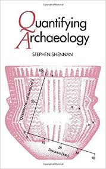
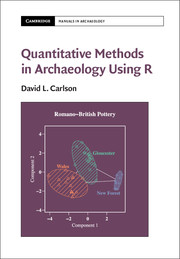

<style>
.small-code pre code {
  font-size: 1.2em;
}

p.small-text {
  font-size: 0.8em;
}
</style>

stat4arch
========================================================
author: Petr Pajdla & Peter Tkáč
autosize: true
width: 1920
height: 1080

AES_707: *Statistics seminar for archaeologists*

<!-- <https://support.rstudio.com/hc/en-us/articles/200486468> -->

<!-- =============================================== -->

Course info
========================================================
type: prompt

- Course website: <https://petrpajdla.github.io/stat4arch/>

- To **pass** the course:  
    - be active (and present) during the bi-weekly on-site sessions,  
    - complete the semestral project assignment.

<!-- =============================================== -->

Seminar 1
========================================================
type: section

`17. 2. 2022`

Today:
<ul style='color:white;'>
  <li>Introduction to quantitative methods in archaeology.
  <li>Introduction to the R programming language and environment.
  <li>Data organization and tidy data.
</ul>

<!-- =============================================== -->

Quantitative methods in archaeology
========================================================
type: section

<!-- ----------------------------------------------- -->

<!-- místo pre Peťa -->

<!-- =============================================== -->

R programming language
========================================================
type: section

<!-- ----------------------------------------------- -->

What is R?
========================================================
left: 10%


***

- Scripting language and environment for statistical computing and graphics.
- Open source, free software.
- Alternatives: Python, SQL, JavaScript etc.
- *Clicking* alternatives: Statistica, PAST etc.  

<https://www.r-project.org/>  
<https://cran.r-project.org/>

<!-- ----------------------------------------------- -->

RStudio
========================================================
left: 20%


***

- IDE (Integrated Development Environment) for R (supports also other languages).

*RStudio is a set of integrated tools designed to help you be more productive with R. It includes a console, syntax-highlighting editor that supports direct code execution, and a variety of robust tools for plotting, viewing history, debugging and managing your workspace.*

<https://rstudio.com/>

<!-- ----------------------------------------------- -->

RStudio IDE
========================================================
right: 30%
title: false

 

***

### RStudio IDE

- Editor is where you view and edit your scripts.
- Console shows the output after you execute the code.
- Environment lists available objects.

And much more...

<!-- ----------------------------------------------- -->

Console
========================================================
class: small-code

```r
R version 4.1.2 (2021-11-01) -- "Bird Hippie"
Copyright (C) 2021 The R Foundation for Statistical Computing
Platform: x86_64-pc-linux-gnu (64-bit)
*
R is free software and comes with ABSOLUTELY NO WARRANTY.
You are welcome to redistribute it under certain conditions.
Type 'license()' or 'licence()' for distribution details.

  Natural language support but running in an English locale

R is a collaborative project with many contributors.
Type 'contributors()' for more information and
'citation()' on how to cite R or R packages in publications.

Type 'demo()' for some demos, 'help()' for on-line help, or
'help.start()' for an HTML browser interface to help.
Type 'q()' to quit R.

> 
```

<!-- ----------------------------------------------- -->

R is a smart calculator
========================================================
class: small-code
incremental: true


```r
2 + 40
```

```
[1] 42
```


```r
((2022 * 2) - 1 / (40 + 2)^3) / 2
```

```
[1] 2022
```


```r
round(6.48^2)
```

```
[1] 42
```


```r
sqrt(1764)
```

```
[1] 42
```


```r
8 * 10^10
```

```
[1] 8e+10
```

<!-- ----------------------------------------------- -->

Console vs script
========================================================
title: false

### Console


- Console evaluates the input immediately after hitting **Enter** and returns the output.

***

### Script


- Script documents the code, i.e. the sequence of commands.
- Script is a *plain* text document.

<p class=small-text>
<b>ctrl + enter</b> send line of code from script to console
</p>

<!-- ----------------------------------------------- -->

Notion of functions and objects
========================================================
incremental: true

### Object

- *Everything* is an object.
- Contains data.
- Some objects are already populated with something...


```r
pi
```

```
[1] 3.141593
```


```r
pi + 1
```

```
[1] 4.141593
```


***

### Function

- Ends with parentheses.  
  `function-name(args...)`
- **Arguments** go in the parentheses.
- Does something.


```r
round(x = pi)
```

```
[1] 3
```


```r
round(x = pi, digits = Inf)
```

```
[1] 3.141593
```

<!-- =============================================== -->

Data organization
========================================================
type: section

<!-- ----------------------------------------------- -->

<!-- místo pre Peťa -->

<!-- =============================================== -->

Homework assignment
========================================================
type: prompt
right: 20%

See <https://petrpajdla.github.io/stat4arch/#seminar-1> for details.  

- Find a dataset you will use for the project assignment.
- Read introductory chapters in one or both of:
    - *Quantifying archaeology* book by Stephen Shennan;
    - *Quantitative Methods in Archaeology* book by David L. Carlson.

***




<!-- =============================================== -->

<!-- TEMPLATE FOR SLIDES -->

Title
========================================================

First column.

***

Second column.

<!-- ----------------------------------------------- -->

Some basics
========================================================

- Two **spaces** at the end of the line break the line.
- HTML can be used to achieve practically anything.

```
<!-- comment -->
*italics*
**bold**
# Header 1 to #### Header 4
 - inserts figure
<url link> or (alt text)[url link]
`single line/word code`
```

<!-- ----------------------------------------------- -->

Section slide
========================================================
type: section

<!-- ----------------------------------------------- -->

Sub-section slide
========================================================
type: sub-section

<!-- ----------------------------------------------- -->

Prompt slide
========================================================
type: prompt

<!-- ----------------------------------------------- -->

Alert slide
========================================================
type: alert
<!-- ----------------------------------------------- -->

