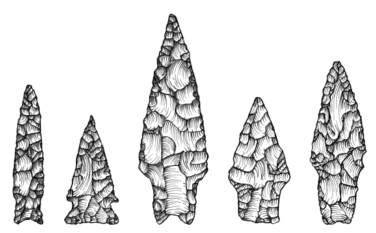

<style>
.small-code pre code {
font-size: 1.2em;
}

p.small-text {
font-size: 0.8em;
}
</style>

stat4arch
========================================================
author: Petr Pajdla & Peter Tkáč
autosize: true
width: 1920
height: 1080

AES_707: *Statistics seminar for archaeologists*

<!-- <https://support.rstudio.com/hc/en-us/articles/200486468> -->

<!-- =============================================== -->

Seminar 2
========================================================
type: section

`3. 3. 2022`

Today:
<ul style='color:white;'>
<li>R data types.
<li>R objects and sub setting.
<li>Packages in R.
<li>How to organize your projects.
<li>Reading data into R.
</ul>

<!-- R data manipulation basics (dplyr package?). -->

<!-- =============================================== -->

R basics
========================================================
type: section

<!-- ----------------------------------------------- -->

Functions and objects
========================================================
incremental: true
class: small-code

### Function
- Ends with parentheses.  
`function-name(args...)`
- **Arguments** go in the parentheses.
- Does something.

```r
sqrt(x = 1764)
```

```
[1] 42
```

- Agruments of a function:

```r
args(sqrt)
```

```
function (x) 
NULL
```

- Getting help on functions:

```r
help(sqrt)
```

```r
?sqrt
```

***

### Object
- *Anything* is an object.
- Contains data.

```r
pi
```

```
[1] 3.141593
```

```r
pi + 1
```

```
[1] 4.141593
```

- Create object by assigning data to it

```r
object_name <- 1
```

- **<-** is an assignment operator 
- Use *Alt + -* shortcut in RStudio

<!-- ----------------------------------------------- -->

Objects
========================================================
incremental: true
class: small-code


```r
object1 <- 1
```

```r
object1
```

```
[1] 1
```

```r
object1 + 1
```

```
[1] 2
```

```r
object2 <- object1 / 2
```

```r
object2
```

```
[1] 0.5
```

```r
object1 <- object1 + object2
```

```r
object1
```

```
[1] 1.5
```

***

- R is **case sensitive**.
- Be consistent in naming things:
  - snake-case: `my_first_object`,
  - camel-case: `myFirstObject`.
- Object names must **not** start with:
  - numbers,
  - special characters.
- Do not overwrite things that already exist in `R`.
- Choose sensible names for objects.

```r
S1 <- pi * 4^2 # for r = 4
```

```r
pi <- 10
```

```r
S2 <- pi * 4^2
```

```r
S1 == S2
```

```
[1] FALSE
```

<!-- =============================================== -->

Packages
========================================================
type: sub-section

<!-- ----------------------------------------------- -->

Packages
========================================================
class: small-code

- R has many functions out of the box.
- There are many **packages** that offer many other, often very specific, functions.
- Official packages are deposited at [CRAN](https://mirrors.nic.cz/R/) repository.
- As of 2022, there are > 18000 packages.

- To **install** packages from CRAN:  
  `install.packages("package_name")`
  
- To be able to use a package, we need to **load** it from our package **library**:  
  `library("package_name")` also `library(package_name)`

<!-- =============================================== -->

Types of data and objects
========================================================
type: section

<!-- ----------------------------------------------- -->

Data types
========================================================
class: small-code
incremental: true

### Text strings
- Any kind of text.
- **Character** data type.
- Always in quotation marks (double or single).


```r
"This is a text string."
```

```
[1] "This is a text string."
```

```r
'This is also a text.'
```

```
[1] "This is also a text."
```

### Dichotomies
- Boolean/binary values (true/false).
- **Logical** data type.
- As `TRUE` and `FALSE` in `R`.


```r
TRUE == FALSE
```

```
[1] FALSE
```

***

### Numbers
#### Integers (whole numbers).
- **Integer** data type.

```r
42L
```

```
[1] 42
```

#### Floating point numbers (decimal point numbers).
- **Double** data type.

```r
4.2
```

```
[1] 4.2
```

- All numbers fall under class **numeric**.

### Special values

- Empty *value* as `NA`, i.e. *not available*.
- Infinities as `Inf` and `-Inf`.


<!-- ----------------------------------------------- -->

Identifying data types
========================================================
class: small-code
incremental: true

- There is a set of functions starting with `is.` prefix.
- These functions return `TRUE`/`FALSE`.


```r
is.character("How are you?")
```

```
[1] TRUE
```

```r
is.numeric(c(4, 4L, 4.2))
```

```
[1] TRUE
```

```r
is.integer(4)
```

```
[1] FALSE
```

```r
is.integer(4L)
```

```
[1] TRUE
```

```r
is.double(42)
```

```
[1] TRUE
```

```r
is.na(1)
```

```
[1] FALSE
```

***


```r
is.numeric(pi)
```

```
[1] TRUE
```

```r
is.double(pi)
```

```
[1] TRUE
```

```r
is.logical(1)
```

```
[1] FALSE
```

```r
is.logical(TRUE)
```

```
[1] TRUE
```

```r
is.logical(FALSE)
```

```
[1] TRUE
```

```r
is.character(mean)
```

```
[1] FALSE
```

```r
is.character("mean")
```

```
[1] TRUE
```

<!-- ----------------------------------------------- -->

Comparing values
========================================================
class: small-code
incremental: true

`<, <=, ==, >=, >, !=`


```r
x <- 1
y <- 100
```

```r
x
```

```
[1] 1
```

```r
y
```

```
[1] 100
```

```r
x < 10
```

```
[1] TRUE
```

```r
x >= y
```

```
[1] FALSE
```

```r
y == 100
```

```
[1] TRUE
```

***


```r
x != y
```

```
[1] TRUE
```

```r
y < Inf
```

```
[1] TRUE
```

```r
x == NA
```

```
[1] NA
```

```r
is.na(x)
```

```
[1] FALSE
```

```r
"apple" == "banana"
```

```
[1] FALSE
```

```r
"pineapple" == "pineapple"
```

```
[1] TRUE
```


<!-- =============================================== -->

Types of objects
========================================================
type: sub-section

<!-- ----------------------------------------------- -->

Vector
========================================================
class: small-code
incremental: true

- Basic data structure.
- Contains a single type of data.
- Created using function `c()` (combine, concatenate)


```r
c("Fuu", "Bar")
```

```
[1] "Fuu" "Bar"
```

```r
x <- c(0, 1, 1, 2, 3, 5, 8, 13, 21, 34, 55, 89, 144)
x
```

```
 [1]   0   1   1   2   3   5   8  13  21  34  55  89 144
```

```r
is.vector(x)
```

```
[1] TRUE
```

***

### Subsetting vectors
- Subset vectors using square brackets `[]`  


```r
x[2]
```

```
[1] 1
```

```r
x[c(2, 4)]
```

```
[1] 1 2
```

```r
x[-1]
```

```
 [1]   1   1   2   3   5   8  13  21  34  55  89 144
```

```r
x[42]
```

```
[1] NA
```

```r
x[2:5]
```

```
[1] 1 1 2 3
```

<!-- ----------------------------------------------- -->

Maths with vectors
========================================================
class: small-code
incremental: true


```r
x <- c(3, 6, 9, 12)
y <- 4:1
```

```r
x
```

```
[1]  3  6  9 12
```

```r
y
```

```
[1] 4 3 2 1
```

```r
x + y
```

```
[1]  7  9 11 13
```

```r
(2 * x) / y
```

```
[1]  1.5  4.0  9.0 24.0
```

```r
y^2
```

```
[1] 16  9  4  1
```

```r
y >= x
```

```
[1]  TRUE FALSE FALSE FALSE
```

***

### Some useful functions

- Return length of a vector with `length()`.

```r
length(x)
```

```
[1] 4
```

- Data type of a vector:

```r
typeof(x)
```

```
[1] "double"
```

```r
is.character(x)
```

```
[1] FALSE
```


```r
z <- c(1, 2, "fuu", 4, 5)
z
```

```
[1] "1"   "2"   "fuu" "4"   "5"  
```

```r
typeof(z)
```

```
[1] "character"
```

<!-- ----------------------------------------------- -->

Matrix
========================================================
class: small-code
incremental: true

- Has rows and columns, rectangular in shape.
- Contains data of a same type, typically numbers.


```r
m <- matrix(data = 1L:20L, ncol = 5, byrow = TRUE)
```

```r
m
```

```
     [,1] [,2] [,3] [,4] [,5]
[1,]    1    2    3    4    5
[2,]    6    7    8    9   10
[3,]   11   12   13   14   15
[4,]   16   17   18   19   20
```

```r
typeof(m)
```

```
[1] "integer"
```

```r
is.matrix(m)
```

```
[1] TRUE
```

***

### Subsetting matrices

- Give `x` and `y` *coordinates* for row and column.  
`matrix[x, y]`


```r
m[2, 1]
```

```
[1] 6
```

```r
m[3, c(2, 4)]
```

```
[1] 12 14
```

```r
m[c(3, 4), 2:3]
```

```
     [,1] [,2]
[1,]   12   13
[2,]   17   18
```

```r
m[1, ]
```

```
[1] 1 2 3 4 5
```

```r
m[, c(2, 4)]
```

```
     [,1] [,2]
[1,]    2    4
[2,]    7    9
[3,]   12   14
[4,]   17   19
```

<!-- ----------------------------------------------- -->

List
========================================================
class: small-code
incremental: true

- Can contain a combination of anything.
- Can have names.


```r
l <- list(
  characters = c("fuu", "bar"), 
  numbers = 1:5,
  logicals = c(TRUE, FALSE, TRUE)
)
```

```r
l
```

```
$characters
[1] "fuu" "bar"

$numbers
[1] 1 2 3 4 5

$logicals
[1]  TRUE FALSE  TRUE
```

```r
length(l)
```

```
[1] 3
```

```r
is.list(l)
```

```
[1] TRUE
```

***

### Subsetting lists
- By position (remains a list).

```r
l[2]
```

```
$numbers
[1] 1 2 3 4 5
```

- By names using `$` operator.
- Returns a vector.

```r
l$logicals
```

```
[1]  TRUE FALSE  TRUE
```

```r
l[[1]] # or double brackets
```

```
[1] "fuu" "bar"
```

```r
l[[1]][2]
```

```
[1] "bar"
```

<!-- ----------------------------------------------- -->

Data frame
========================================================
class: small-code
incremental: true

- A special kind of a list.
- All list items have same number of rows.
- Rectangular structure.


```r
dfr <- data.frame(
  x = 95:98, 
  y = c("a", "b", "c", "d"),
  z = c(T, F, F, T),
  w = seq(4.2, 4.8, by = 0.2) # sequence
)
```

```r
dfr
```

```
   x y     z   w
1 95 a  TRUE 4.2
2 96 b FALSE 4.4
3 97 c FALSE 4.6
4 98 d  TRUE 4.8
```

```r
is.data.frame(dfr)
```

```
[1] TRUE
```

```r
typeof(dfr)
```

```
[1] "list"
```

***

### Subsetting data frames


```r
dfr[2, 1]
```

```
[1] 96
```


```r
dfr[2, c(1, 3)]
```

```
   x     z
2 96 FALSE
```

```r
dfr[, 1]
```

```
[1] 95 96 97 98
```

```r
dfr$x
```

```
[1] 95 96 97 98
```

```r
dfr[, "y"]
```

```
[1] "a" "b" "c" "d"
```

```r
dfr[-c(1, 2), ]
```

```
   x y     z   w
3 97 c FALSE 4.6
4 98 d  TRUE 4.8
```

<!-- =============================================== -->

Exploring the structure of an object
========================================================
class: small-code
incremental: true


```r
dfr
```

```
   x y     z   w
1 95 a  TRUE 4.2
2 96 b FALSE 4.4
3 97 c FALSE 4.6
4 98 d  TRUE 4.8
```

```r
nrow(dfr) # nr. of rows
```

```
[1] 4
```

```r
ncol(dfr) # nr. of columns
```

```
[1] 4
```

```r
dim(dfr) # dimensions
```

```
[1] 4 4
```

***


```r
str(dfr) # structure
```

```
'data.frame':	4 obs. of  4 variables:
 $ x: int  95 96 97 98
 $ y: chr  "a" "b" "c" "d"
 $ z: logi  TRUE FALSE FALSE TRUE
 $ w: num  4.2 4.4 4.6 4.8
```

```r
colnames(dfr) # column names
```

```
[1] "x" "y" "z" "w"
```

```r
rownames(dfr) # row names
```

```
[1] "1" "2" "3" "4"
```

```r
head(dfr) # returns top rows of a data frame, also tail()
```

```
   x y     z   w
1 95 a  TRUE 4.2
2 96 b FALSE 4.4
3 97 c FALSE 4.6
4 98 d  TRUE 4.8
```

<!-- ----------------------------------------------- -->

<!-- =============================================== -->

Let's practice!
========================================================
type: prompt
incremental: true

1. Start **RStudio**.
2. In the **Console**, install `archdata` package.
3. Create a new script *(Ctrl + Shift + n)*.
4. Load the `archdata` package from the **library**.
4. Load a **DartPoints** data set from the **archdata** package:
   `data("DartPoints", package = "archdata")`
5. Notice the object `DartPoints` is loaded in the **Environment** panel.
6. What class is the `DartPoints` object?
7. How large (number of rows and columns) is the data set?
8. What columns does it have?
8. Explore the contents of the object...
9. Read details about the data set using `help(DartPoints)` nebo `?DartPoints`

***

### Solution


```r
install.packages("archdata")
```

```r
library(archdata)
```

```r
data("DartPoints", package = "archdata")
```

```r
class(DartPoints)
```

```
[1] "data.frame"
```

```r
dim(DartPoints) # also nrow()/ncol()
```

```
[1] 91 17
```

```r
colnames(DartPoints)
```

```
 [1] "Name"      "Catalog"   "TARL"      "Quad"      "Length"    "Width"    
 [7] "Thickness" "B.Width"   "J.Width"   "H.Length"  "Weight"    "Blade.Sh" 
[13] "Base.Sh"   "Should.Sh" "Should.Or" "Haft.Sh"   "Haft.Or"  
```

<!-- ----------------------------------------------- -->

Explore the object I
========================================================
title: false
type: prompt
class: small-code
incremental: true


```r
head(DartPoints, n = 4)
```

```
  Name Catalog     TARL  Quad Length Width Thickness B.Width J.Width H.Length
1 Darl 41-0322 41CV0536 26/59   42.8  15.8       5.8    11.3    10.6     11.6
2 Darl 35-2946 41CV0235 21/63   40.5  17.4       5.8      NA    13.7     12.9
3 Darl 35-2921 41CV0132 20/63   37.5  16.3       6.1    12.1    11.3      8.2
4 Darl 36-3487 41CV0594 10/54   40.3  16.1       6.3    13.5    11.7      8.3
  Weight Blade.Sh Base.Sh Should.Sh Should.Or Haft.Sh Haft.Or
1    3.6        S       I         S         T       S       E
2    4.5        S       I         S         T       S       E
3    3.6        S       I         S         T       S       E
4    4.0        S       I         S         T       S       E
```

```r
tail(DartPoints, n = 4)
```

```
    Name Catalog     TARL  Quad Length Width Thickness B.Width J.Width H.Length
88 Wells 35-2898 41CV0876 21/66   55.4  19.3       5.3    11.3    15.6     15.2
89 Wells 35-2458 41CV0810 23/62   45.8  18.9       6.5    12.1    12.2     10.9
90 Wells 35-3012 41CV0270 24/62   49.1  21.1       6.3    14.8    15.2     16.6
91 Wells 44-0732 41BL0239 39/55   63.1  24.7       5.4    10.3    12.1     21.1
   Weight Blade.Sh Base.Sh Should.Sh Should.Or Haft.Sh Haft.Or
88    5.6        E       S         I         T       S       T
89    4.9        S       E         S         T       S       P
90    5.2        S       E         S         T       S       P
91   16.3        S       E         S         T       S       T
```

<!-- ----------------------------------------------- -->

Explore the object II
========================================================
title: false
type: prompt
class: small-code


```r
str(DartPoints)
```

```
'data.frame':	91 obs. of  17 variables:
 $ Name     : Factor w/ 5 levels "Darl","Ensor",..: 1 1 1 1 1 1 1 1 1 1 ...
 $ Catalog  : chr  "41-0322" "35-2946" "35-2921" "36-3487" ...
 $ TARL     : chr  "41CV0536" "41CV0235" "41CV0132" "41CV0594" ...
 $ Quad     : chr  "26/59" "21/63" "20/63" "10/54" ...
 $ Length   : num  42.8 40.5 37.5 40.3 30.6 41.8 40.3 48.5 47.7 33.6 ...
 $ Width    : num  15.8 17.4 16.3 16.1 17.1 16.8 20.7 18.7 17.5 15.8 ...
 $ Thickness: num  5.8 5.8 6.1 6.3 4 4.1 5.9 6.9 7.2 5.1 ...
 $ B.Width  : num  11.3 NA 12.1 13.5 12.6 12.7 11.7 14.7 14.3 NA ...
 $ J.Width  : num  10.6 13.7 11.3 11.7 11.2 11.5 11.4 13.4 11.8 12.5 ...
 $ H.Length : num  11.6 12.9 8.2 8.3 8.9 11 7.6 9.2 8.9 11.5 ...
 $ Weight   : num  3.6 4.5 3.6 4 2.3 3 3.9 6.2 5.1 2.8 ...
 $ Blade.Sh : Factor w/ 4 levels "E","I","R","S": 4 4 4 4 4 4 2 1 1 1 ...
 $ Base.Sh  : Factor w/ 4 levels "E","I","R","S": 2 2 2 2 2 1 2 2 4 2 ...
 $ Should.Sh: Factor w/ 4 levels "E","I","S","X": 3 3 3 3 3 2 3 2 2 3 ...
 $ Should.Or: Factor w/ 4 levels "B","H","T","X": 3 3 3 3 3 3 3 3 2 3 ...
 $ Haft.Sh  : Factor w/ 5 levels "A","E","I","R",..: 5 5 5 5 5 3 3 5 5 5 ...
 $ Haft.Or  : Factor w/ 5 levels "C","E","P","T",..: 2 2 2 2 2 1 2 2 2 3 ...
```

<!-- ----------------------------------------------- -->

Small code-along project
========================================================
type: section

  

<p class=small-text>Dart points, adapted from Carlson 2011.</p>

<!-- ----------------------------------------------- -->

Section slide
========================================================
type: section

<!-- ----------------------------------------------- -->

Prompt slide
========================================================
type: prompt

<!-- ----------------------------------------------- -->

Alert slide
========================================================
type: alert
<!-- ----------------------------------------------- -->

