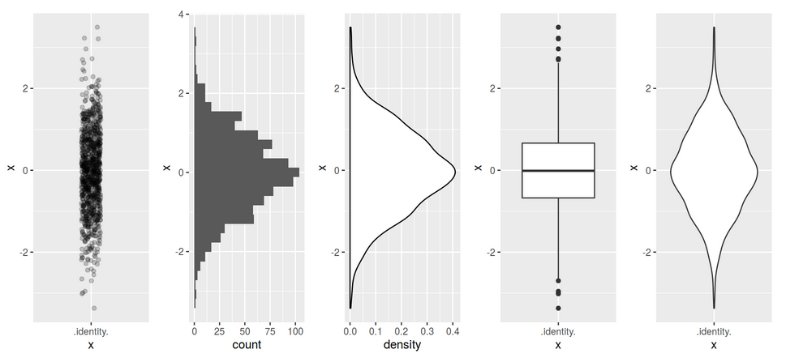

stat4arch
========================================================
author: Petr Pajdla & Peter Tkáč
autosize: true
width: 1920
height: 1080

AES_707: *Statistics seminar for archaeologists*

<!-- <https://support.rstudio.com/hc/en-us/articles/200486468> -->

<!-- =============================================== -->

Seminar 3
========================================================
type: section


`17. 3. 2022`

## Today:
<ul style='color:white;'>
<li>Data visualization, plots for one variable.
<li>Descriptive stats.
<li>Data manipulation basics (base R and dplyr package).
<li>Plotting in ggplot2.
</ul>

<!-- =============================================== -->

Descriptive statistics
========================================================
type: section

<!-- ----------------------------------------------- -->

Characterizing centrality
========================================================
incremental: false

### Mean
`mean(x)`  
$\begin{aligned}
\overline{x} = \frac{x_1 + x_2 + \cdots + x_n}{n} = \frac{1}{n} (\sum^n_{i=1}x_i)
\end{aligned}$

### Median 
`median(x)`  
**Robust**, minimizes influence of outliers.

***


<!-- ----------------------------------------------- -->

Characterizing dispersion and/or spread
========================================================
incremental: false

### Range
(*rozpětí*)  
`max(x) - min(x)` or `range(x)`

### Variance and Standard deviation
(*rozptyl* a *směrodatná odchylka*)  
`sd(x)`  
$\begin{aligned}
\sigma = \sqrt{s^2} = \sqrt{\frac{\sum(x_i-\overline{x})^2}{n-1}}
\end{aligned}$

### Interquartile range
(midspread, IQR, *kvantil*, *mezikvartilové rozpětí*)  
`IQR(x)`  
**Robust**, minimizes influence of outliers.

<!-------------------------------------------------- -->

Fuu
========================================================
title: false



<!-------------------------------------------------- -->

Why look at data then?
========================================================
*Anscombe's quartet*


```
# A tibble: 4 × 6
    set `mean(x)` `sd(x)` `mean(y)` `sd(y)` `cor(x, y)`
  <int>     <dbl>   <dbl>     <dbl>   <dbl>       <dbl>
1     1         9    3.32      7.50    2.03       0.816
2     2         9    3.32      7.50    2.03       0.816
3     3         9    3.32      7.5     2.03       0.816
4     4         9    3.32      7.50    2.03       0.817
```

Four sets of numerical data, all have almost identical 
values of descriptive statistics...

<!-------------------------------------------------- -->

Why look at data then?
========================================================


<!-- =============================================== -->

Visualizing data
========================================================
type: section

<!-- ----------------------------------------------- -->

Brainstorming
========================================================
type: prompt
incremental: true

- Prečo potrebujeme vizualizovať data?
- Aké vlastnosti má mať dobrý graf?
- Aké prvky vieme na grafe pomenovať?


<!-- ----------------------------------------------- -->

Data viz
========================================================


*(Minard 1869)*

<!-- ----------------------------------------------- -->

Data viz
========================================================


*(Snow 1854)*

<!-- ----------------------------------------------- -->

<!-- Data viz -->
<!-- ======================================================= -->

<!--  -->

<!-- (Paygap) -->

<!-- ----------------------------------------------- -->

Types of graphs
========================================================
type: section

<!-- ----------------------------------------------- -->

Bar chart
========================================================
*(Sloupcový graf)*  
Distribution of values of a **qualitative** variable.


<!-- ----------------------------------------------- -->

Histogram
========================================================
Distribution of values of a **quantitative** variable.


<!-- ----------------------------------------------- -->

Density plot
========================================================
Similar to histogram, great for comparison.


<!-- ----------------------------------------------- -->

Boxplot 
========================================================
*(Krabicový graf)*   
**Comparison** of two and more **quantitative** variables. 


<!-- ----------------------------------------------- -->

Boxplot
========================================================


<!-- =============================================== -->

Plotting in R
========================================================
type: section

<ul style='color:white;'>
<li>Base graphics with `plot`
<li>Package `ggplot2`
</ul>

<!-- ----------------------------------------------- -->

Base graphics
========================================================
incremental: false
right: 60%

Cvičenie s tabulkou `lokality`.


```
   lokalita objekty_ks
1 Vedrovice         27
2  Kyjovice         13
3  Pohansko         55
4 Mikulčice         29
5    Znojmo         20
```

***


```r
barplot(lokality$objekty_ks, 
        names.arg = lokality$lokalita, 
        col = "lightblue")
```


<!-- ----------------------------------------------- -->

Package ggplot2
========================================================
incremental: false


```r
install.packages("ggplot2")
```

```r
library(ggplot2)
```

## Syntax

 

<!-- ----------------------------------------------- -->

ggplot2: syntax
========================================================
title: false


```r
ggplot(data = lokality, aes(x = lokalita, y = objekty_ks)) +
  geom_bar(stat = "identity")
```


<!-- ----------------------------------------------- -->

ggplot2: syntax
========================================================
title: false

Dlhý zápis:

```r
ggplot(data = lokality, mapping = aes(x = lokalita, y = objekty_ks)) +
  geom_bar(stat = "identity")
```

Krátky zápis:

```r
ggplot(lokality, aes(lokalita, objekty_ks)) +
  geom_bar(stat = "identity")
```


<!-- ----------------------------------------------- -->

Barplot
========================================================
incremental: true

Cvičenie s databázou `EWBurials`.


```r
library(archdata) # ?EWBurials
data(EWBurials)
hroby <- data.frame(EWBurials)
head(hroby, 4)
```

```
     Group  North  West         Age  Sex Direction Looking   Goods
011      2  96.96 90.32 Young Adult Male        42     283 Present
014      2 100.20 90.61 Young Adult Male        28     272 Present
015      2 101.74 91.62   Old Adult Male       350     219 Present
016a     2 101.00 90.47 Young Adult Male       335      60  Absent
```

## Otázky
- aký je pomer mužských a ženských hrobov?
- aké je zastúpenie vekových kategórií medzi pohlaviami?
- líšila sa prítommosť milodarov (1) v závislosti na pohlaví alebo (2) v závislosti na veku?
- aké sú rozdiely medzi skupinami?

<!-- ----------------------------------------------- -->

1. Aký je pomer mužských a ženských hrobov?
========================================================
incremental: true


```r
p <- ggplot(hroby, aes(x = Sex))
```

```r
p + geom_bar()
```


***

Ako by ste spravili podobný graf, zobrazujúci rozdelenie hrobov podľa veku?


```r
p <- ggplot(hroby, aes(x = Age))
```

```r
p + geom_bar()
```


<!-- ----------------------------------------------- -->

<!-- 1. Aký je pomer mužských a ženských hrobov? -->
<!-- ======================================================== -->
<!-- incremental: true -->

<!-- ## Drobné úpravy grafu -->
<!-- ### Farba -->
<!-- `geom_bar(fill =, color=)` -->
<!-- ```{r} -->
<!-- p <- ggplot(hroby, aes(x=Sex)) -->
<!-- ``` -->
<!-- ```{r} -->
<!-- p + geom_bar(fill = "pink", color= "black") -->
<!-- ``` -->

<!-- ----------------------------------------------- -->

Labels
========================================================
incremental: true


```r
p <- ggplot(hroby, aes(x = Sex)) +
  geom_bar()
```

```r
p + labs(x = "pohlaví", 
         y = "počet", 
         title = "Počet hrobů podle pohlaví", 
         caption = "Archdata::EWBurials")
```


<!-- ----------------------------------------------- -->

2. Aké je zastúpenie vekových kategórií medzi pohlaviami?
========================================================
incremental: false

Stacked bar chart: `geom_bar()`.


```r
p <- ggplot(hroby, aes(x = Sex, fill = Age))
```

```r
p + geom_bar()
```


<!-- ----------------------------------------------- -->

2. Aké je zastúpenie vekových kategórií medzi pohlaviami?
========================================================

Dodged bar chart: `geom_bar(position = "dodge")`.


```r
p <- ggplot(hroby, aes(x = Sex, fill = Age))
```

```r
p + geom_bar(position = "dodge")
```


<!-- ----------------------------------------------- -->

3a. Líšila sa prítommosť milodarov v závislosti na pohlaví?
========================================================


```r
p <- ggplot(hroby, aes(x = Sex, fill = Goods))
```

```r
p + geom_bar()
```


<!-- ----------------------------------------------- -->

<!-- 3a. líšila sa prítommosť milodarov v závislosti na pohlaví? -->
<!-- ======================================================================= -->
<!-- incremental: true -->

<!-- ## Vlastné farby -->
<!-- `scale_fill_manual(values = )` -->
<!-- ```{r} -->
<!-- my_colors <- c("red", "black") -->
<!-- ``` -->

<!-- ```{r} -->
<!-- p <- ggplot(hroby, aes(x = Sex, fill = Goods)) -->
<!-- ``` -->
<!-- ```{r} -->
<!-- p + geom_bar() + -->
<!--   scale_fill_manual(values = my_colors) -->
<!-- ``` -->

<!-- ----------------------------------------------- -->

3b. Líšila sa prítommosť milodarov v závislosti na veku?
========================================================
incremental: true

## Absolútne čísla


```r
p <- ggplot(hroby, aes(x = Age, fill = Goods))
```

```r
p + geom_bar()
```


<!-- ----------------------------------------------- -->

3b. Líšila sa prítommosť milodarov v závislosti na veku?
========================================================
incremental: true

## Relatívny pomer
`geom_bar(position = "fill")`

```r
p <- ggplot(hroby, aes(x = Age, fill = Goods))
```

```r
p + geom_bar(position = "fill")
```


<!-- ----------------------------------------------- -->

4. Aké sú rozdiely medzi skupinami?
========================================================
incremental: true


```r
p <- ggplot(hroby, aes(x = Age))
```

```r
p + geom_bar() +
  facet_grid(Sex ~ Group)
```


<!-- *** -->

<!-- ```{r} -->
<!-- p + geom_bar() + -->
<!--   facet_grid(Sex ~ Group) + -->
<!--   theme (axis.text.x = element_text(angle = 60, hjust = 1)) -->
<!-- ``` -->

<!-- ----------------------------------------------- -->

Aby to nebolo tak jednoduché...
========================================================
type: prompt

Aký je rozdiel medzi týmito datasetmi?

`hroby`

```
     Group  North  West         Age  Sex Direction Looking   Goods
011      2  96.96 90.32 Young Adult Male        42     283 Present
014      2 100.20 90.61 Young Adult Male        28     272 Present
015      2 101.74 91.62   Old Adult Male       350     219 Present
016a     2 101.00 90.47 Young Adult Male       335      60  Absent
018      2 101.65 90.46   Old Adult Male         3      86 Present
020      1  95.17 90.53 Young Adult Male       142      21  Absent
```

`lokality`

```
   lokalita objekty_ks
1 Vedrovice         27
2  Kyjovice         13
3  Pohansko         55
4 Mikulčice         29
5    Znojmo         20
```

<!-- ----------------------------------------------- -->

Fuu
========================================================
title: false


```r
p <- ggplot(hroby, aes(x = Age))
p + geom_bar()
```


***


```r
p <- ggplot(lokality, 
            aes(x = lokalita, 
                y = objekty_ks))
p + geom_bar(stat="identity")
```


<!-- =============================================== -->

Project assignment
========================================================
type: prompt

## Where to look for data sets?

- **Journal of Open Archaeology Data**  
<https://openarchaeologydata.metajnl.com/>

- Book **Qunatitative Methods in Archaeology Using R** by D. L. Carlson and associated R package `archdata`
    

```r
library(archdata)
?archdata # list of data sets in the package
```

