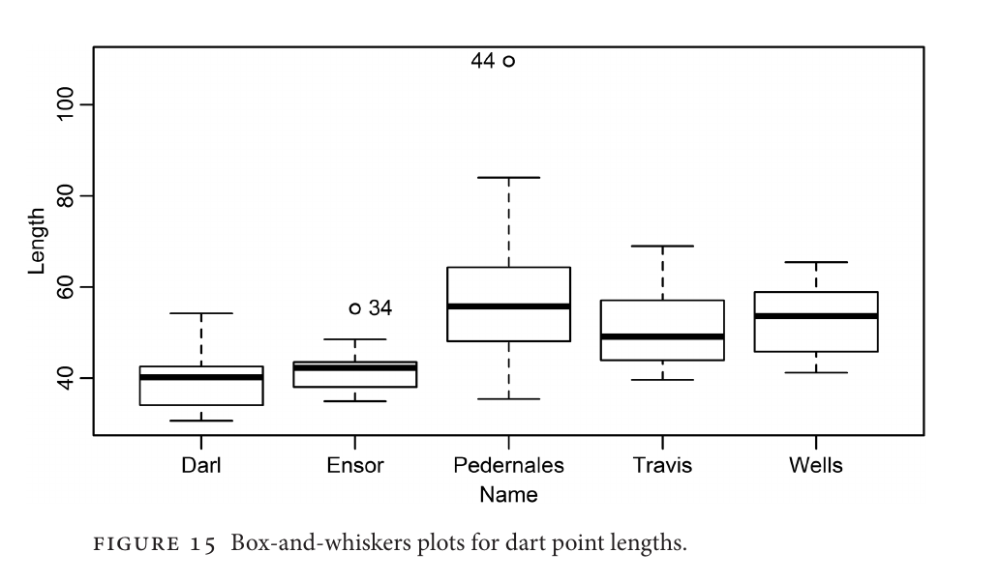
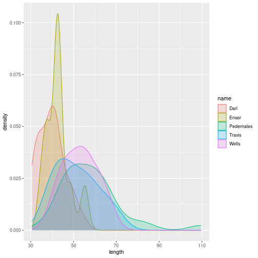
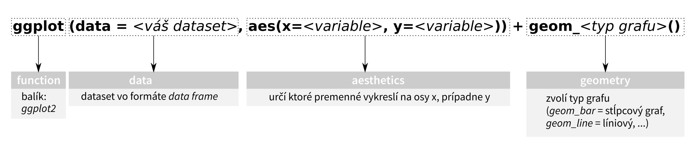
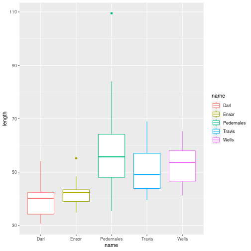
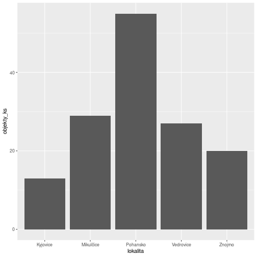
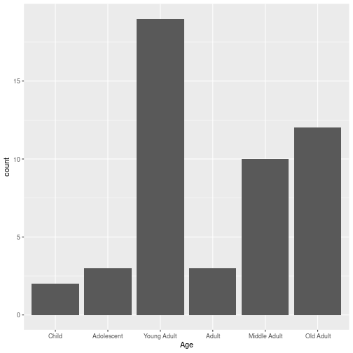
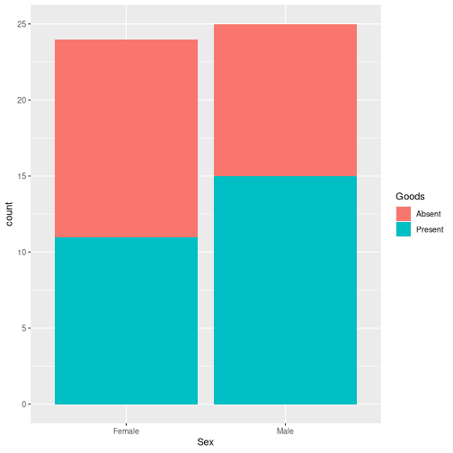
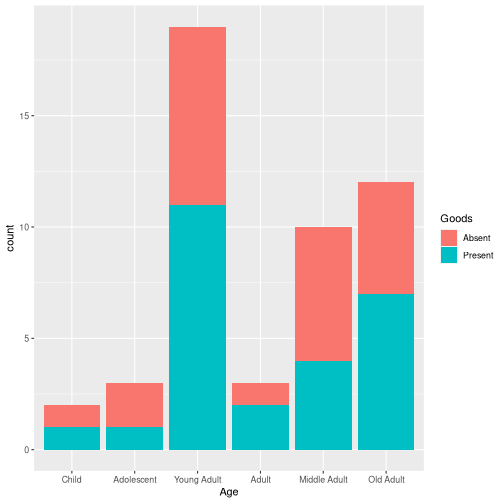
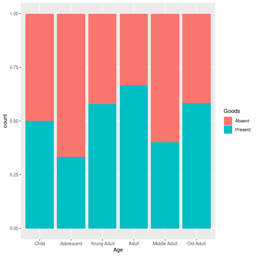
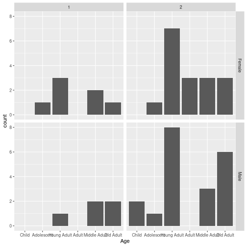

stat4arch
========================================================
author: Petr Pajdla & Peter Tkáč
autosize: true
width: 1920
height: 1080

AES_707: *Statistics seminar for archaeologists*

<!-- <https://support.rstudio.com/hc/en-us/articles/200486468> -->

<!-- =============================================== -->

Seminar 3
========================================================
type: section


`17. 3. 2022`

## Today:
<ul style='color:white;'>
  <li>Organizing projects in R.
  <li>Reading data into R.
  <li>Data visualization, plots for one variable.
  <li>Descriptive stats.
  <li>Data manipulation basics (base R and dplyr package).
  <li>Plotting in ggplot2.
</ul>

<!-- =============================================== -->

Visualizing data
========================================================
type: section


<!-- ----------------------------------------------- -->

Brainstorming
========================================================
type: prompt
incremental: true

<ul style='color:white;'>
  <li> Prečo potrebujeme vizualizovať data?
  <li> Aké vlastnosti má mať dobrý graf?
  <li> Aké prvky vieme na grafe pomenovať?
</ul>



<!-- ----------------------------------------------- -->

Data viz
=======================================================


(Minard)

<!-- ------------------------------------------------------------------------- -->

Data viz
=======================================================


(Snow)

Data viz
=======================================================


(Paygap)

Types of graphs
===========================================================
type: section
<!-- ----------------------------------------------------------------------- -->

Bar chart (sloupcový graf)
===============================================================
Distribuce počtu hodnot kvalitativní proměnné,  
případně diskrétní kvantitativní proměnné.


<!-- ----------------------------------------------------------------------- -->

Histogram
=================================================================================
Distribuce hodnot kvantitativní proměnné.


<!-- ----------------------------------------------------------------------- -->

Density plot
=================================================================

Podobnost s histogramem, vhodný pro porovnávání.


<!-- ----------------------------------------------------------------------- -->

Boxplot (krabicový graf)
==================================================================
Porovnávání dvou a více kvantitativních proměnných  


<!-- ----------------------------------------------------------------------- -->

Boxplot (krabicový graf)
==================================================================


<!-- ------------------------------------------------------------------------ -->
Tvorba grafov v R
===================================================================
type: section
<ul style='color:white;'>
  <li>`plot`
  <li>`ggplot2`
</ul>

<!-- ------------------------------------------------------------------------- -->
plot, barplot,...
==============================================================
incremental: true

## cvičenie s databázou `df2`


```
   lokalita objekty_ks
1 Vedrovice         27
2  Kyjovice         13
3  Pohansko         55
4 Mikulčice         29
5    Znojmo         20
```


```r
plot(df2)
```


***


```r
barplot(df2$objekty_ks, names.arg = df2$lokalita, col="lightblue")
```



<!-- -------------------------------------------------------------------- -->


ggplot - syntax
=============================================================
incremental: true
 


```r
ggplot(data=df2, aes(x=lokalita, y = objekty_ks))+
  geom_bar(stat="identity")
```



<!-- ----------------------------------------------------- -->
ggplot - syntax
=============================================================
Dlhý zápis:

```r
ggplot(data = df2, mapping = aes(x=lokalita, y = objekty_ks))+
  geom_bar(stat="identity")
```


***
Krátky zápis:

```r
ggplot(df2, aes(x=lokalita, y = objekty_ks))+
  geom_bar(stat="identity")
```



<!-- ------------------------------ -->

Barplot
============================================
incremental: true

## Cvičenie s databázou `EWBurials`


```r
library(archdata)
data(EWBurials)
hroby<-data.frame(EWBurials)
head(hroby)
```

```
     Group  North  West         Age  Sex Direction Looking   Goods
011      2  96.96 90.32 Young Adult Male        42     283 Present
014      2 100.20 90.61 Young Adult Male        28     272 Present
015      2 101.74 91.62   Old Adult Male       350     219 Present
016a     2 101.00 90.47 Young Adult Male       335      60  Absent
018      2 101.65 90.46   Old Adult Male         3      86 Present
020      1  95.17 90.53 Young Adult Male       142      21  Absent
```

## Otázky
- aký je pomer mužských a ženských hrobov?
- aké je zastúpenie vekových kategórií medzi pohlaviami?
- líšila sa prítommosť milodarov (1) v závislosti na pohlaví alebo (2) v závislosti na veku?
- aké sú rozdiely medzi skupinami?

<!-- ----------------------------------- -->

1. Aký je pomer mužských a ženských hrobov?
===============================================================
incremental: true


```r
p <- ggplot(hroby, aes(x=Sex))
```

```r
p + geom_bar()
```


***
Ako by ste spravili podobný graf, zobrazujúci rozdelenie hrobov podľa veku?


```r
p <- ggplot(hroby, aes(x=Age))
```

```r
p + geom_bar()
```


<!-- ------------------------------------------------- -->

1. Aký je pomer mužských a ženských hrobov?
===============================================================
incremental: true

## Drobné úpravy grafu
### Farba
`geom_bar(fill =, color=)`

```r
p <- ggplot(hroby, aes(x=Sex))
```

```r
p + geom_bar(fill = "pink", color= "black")
```


<!-- ---------------------------------- -->

========================================
incremental: true
### Popisky
`labs(x=, y=, title=, caption=)`

```r
p <- ggplot(hroby, aes(x=Sex))
```

```r
p + geom_bar(fill = "pink", color= "black") +
  labs(x = "pohlaví", 
       y = "počet", 
       title = "Počet hrobů podle pohlaví", 
       caption="Archdata::EWBurials")
```


<!-- ----------------------------------- -->

2. aké je zastúpenie vekových kategórií medzi pohlaviami?
===================================================================
incremental: true

## "stacked bar"


```r
p <- ggplot(hroby, aes(x=Sex, fill=Age))
```

```r
p + geom_bar()
```


<!--------------------------------------------- -->
2. aké je zastúpenie vekových kategórií medzi pohlaviami?
===================================================
## "dodged bar"
`geom_bar(position = "dodge")`

```r
p <- ggplot(hroby, aes(x=Sex, fill=Age))
```

```r
p + geom_bar(position = "dodge")
```


<!-- =============================================== -->

3a. líšila sa prítommosť milodarov v závislosti na pohlaví?
=======================================================================
incremental: true

## `fill`


```r
p <- ggplot(hroby, aes(x=Sex, fill=Goods))
```

```r
p + geom_bar()
```


<!-- --------------------------------------------- -->
3a. líšila sa prítommosť milodarov v závislosti na pohlaví?
=======================================================================
incremental: true
## Vlastné farby
`scale_fill_manual(values = )`

```r
my_colors <- c("red", "black")
```


```r
p <- ggplot(hroby, aes(x=Sex, fill=Goods))
```

```r
p + geom_bar() +
  scale_fill_manual(values = my_colors)
```


<!-- ----------------------------------------------- -->

3b. líšila sa prítommosť milodarov v závislosti na veku?
==========================================================
incremental: true

## Absolútne čísla


```r
p <- ggplot(hroby, aes(x=Age, fill=Goods))
```

```r
p + geom_bar()
```


<!-- --------------------------- -->

3b. líšila sa prítommosť milodarov v závislosti na veku?
=======================================================================
incremental: true
## Relatívny pomer
`geom_bar(position = "fill")`

```r
p <- ggplot(hroby, aes(x=Age, fill=Goods))
```

```r
p + geom_bar(position = "fill")
```



<!-- ------------------------------------------------------ -->

4. aké sú rozdiely medzi skupinami?
==========================================================
incremental: true


```r
p <- ggplot(hroby, aes(x=Age))
```

```r
p + geom_bar() +
  facet_grid(Sex ~ Group)
```


***

```r
p + geom_bar() +
  facet_grid(Sex ~ Group) + 
  theme (axis.text.x = element_text(angle=60, hjust=1))
```


<!--- ------------------- -->

Aby to nebolo tak jednoduché...
========================================================
type: prompt
## Aký je rozdiel medzi týmito datasetmi?
`hroby`

```
     Group  North  West         Age  Sex Direction Looking   Goods
011      2  96.96 90.32 Young Adult Male        42     283 Present
014      2 100.20 90.61 Young Adult Male        28     272 Present
015      2 101.74 91.62   Old Adult Male       350     219 Present
016a     2 101.00 90.47 Young Adult Male       335      60  Absent
018      2 101.65 90.46   Old Adult Male         3      86 Present
020      1  95.17 90.53 Young Adult Male       142      21  Absent
```
`df2`

```
   lokalita objekty_ks
1 Vedrovice         27
2  Kyjovice         13
3  Pohansko         55
4 Mikulčice         29
5    Znojmo         20
```

<!-- ----------------------------------------------- -->

======================================================

```r
p<-ggplot(df2, aes(x=lokalita, y=objekty_ks))
p+geom_bar(stat="identity")
```


***

```r
p <- ggplot(hroby, aes(x=Age))
p + geom_bar()
```


<!-- --------------------------------- -->

Descriptive statistics
========================================================
type: section

<!-- ----------------------------------------------- -->

Characterizing centrality
=====================================================

### Mean
`mean(x)`  
$\begin{aligned}
\overline{x} = \frac{x_1 + x_2 + \cdots + x_n}{n} = \frac{1}{n} (\sum^n_{i=1}x_i)
\end{aligned}$

### Median 
`median(x)`  
**Robust**, minimizes influence of outliers.

***


<!-- ----------------------------------------------- -->

Characterizing dispersion and/or spread
===================================================

### Range
(*rozpětí*)  
`max(x) - min(x)` or `range(x)`

### Variance and Standard deviation
(*rozptyl* a *směrodatná odchylka*)  
`sd(x)`  
$\begin{aligned}
s = \sqrt{s^2} = \sqrt{\frac{\sum(x_i-\overline{x})^2}{n-1}}
\end{aligned}$

### Interquartile range
(midspread, IQR)  
`IQR(x)`  
**Robust**, minimizes influence of outliers.

<!-------------------------------------------------- -->

Why look at data then?
=======================================================
*Anscombe's quartet*


```
# A tibble: 4 × 6
    set `mean(x)` `sd(x)` `mean(y)` `sd(y)` `cor(x, y)`
  <int>     <dbl>   <dbl>     <dbl>   <dbl>       <dbl>
1     1         9    3.32      7.50    2.03       0.816
2     2         9    3.32      7.50    2.03       0.816
3     3         9    3.32      7.5     2.03       0.816
4     4         9    3.32      7.50    2.03       0.817
```

Four sets of numerical data, all have almost identical 
values of descriptive statistics...

<!------------------------------------------------------------>

Why look at data then?
======================================================


<!-- ----------------------------------------------- -->

Let's practice
=======================================================
type: prompt
incremental: false

- Clean your working environment.
- Download data:

```r
url <- "https://1url.cz/@stat4arch02"
download.file(url, here::here("datasaurus.csv"))
```
- Create a new script.
- Read the data.

<!-- =============================================== -->

Title
========================================================

First column.

***

Second column.

<!-- ----------------------------------------------- -->

Some basics
========================================================

- Two **spaces** at the end of the line break the line.
- HTML can be used to achieve practically anything.

```
<!-- comment -->
*italics*
**bold**
# Header 1 to #### Header 4
 - inserts figure
<url link> or (alt text)[url link]
`single line/word code`
```

<!-- ----------------------------------------------- -->

Section slide
========================================================
type: section

<!-- ----------------------------------------------- -->

Prompt slide
========================================================
type: prompt

<!-- ----------------------------------------------- -->

Alert slide
========================================================
type: alert
<!-- ----------------------------------------------- -->

