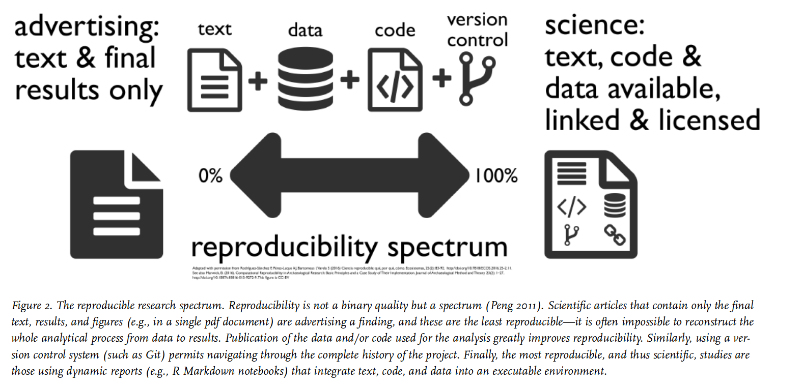
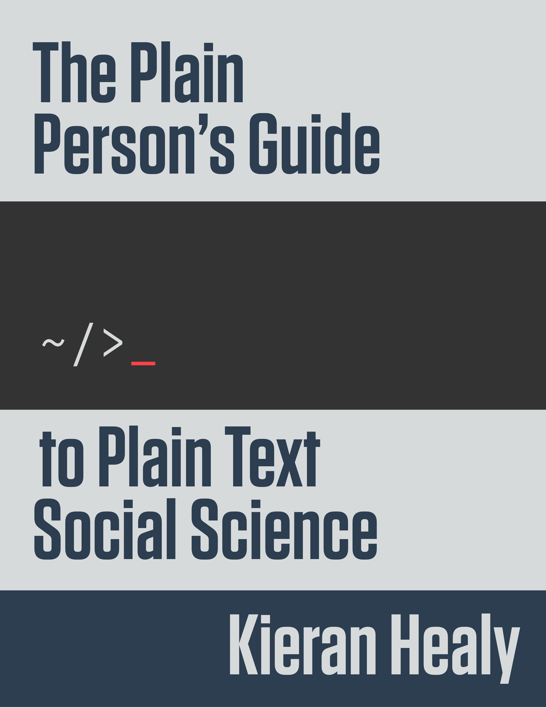
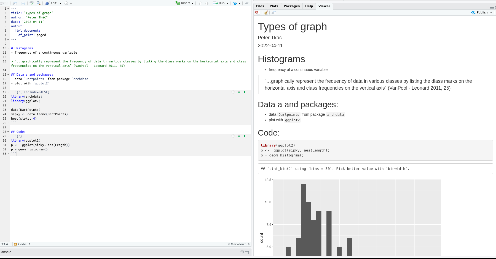
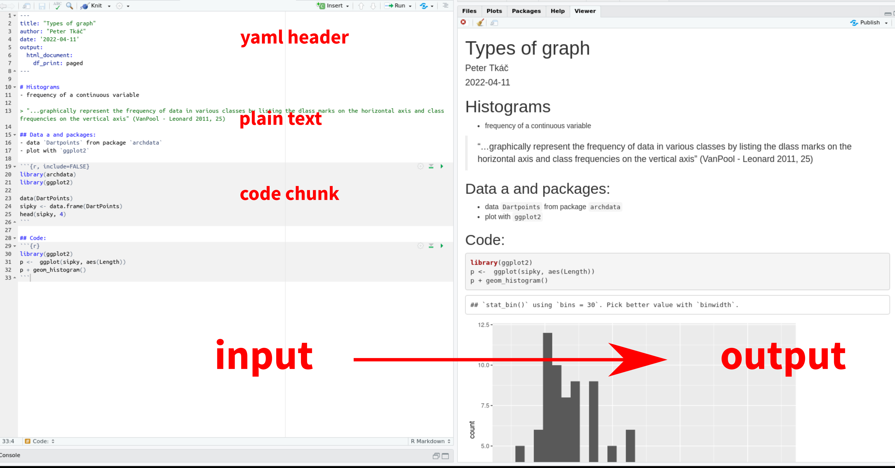
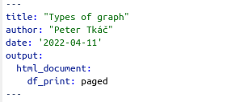
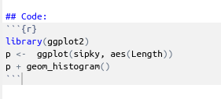
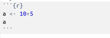
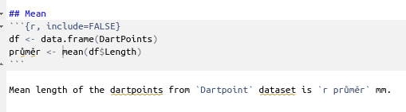
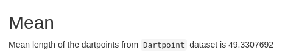

stat4arch
========================================================
author: Petr Pajdla & Peter Tkáč
autosize: true
width: 1920
height: 1080

AES_707: *Statistics seminar for archaeologists*

<!-- <https://support.rstudio.com/hc/en-us/articles/200486468> -->

<!-- =============================================== -->

Seminar 5
========================================================
type: section

`14. 4. 2022`

Today:
<ul style='color:white;'>
  <li>Reproducibility
  <li>Rmarkdown
  <li>Your datasets
</ul>


<!-- =============================================== -->

Reproducible research
=========================================================
type: section

Reproducibility
========================================================

- Allow other people to build up on your work...

*For the findings of a study to be reproducible means that results obtained (...) in a* **statistical analysis of a data set** *should be achieved again with a high degree of reliability when the study is replicated.*  
<https://en.wikipedia.org/wiki/Reproducibility>



<p style="font-size:60%;">
(Marwick et al. 2017; Marwick et al. 2018; <https://faculty.washington.edu/bmarwick/>)
</p>

In your article/thesis/project do: 
========================================================
left: 40%

- Deposit the data in a **repository**.
  [Zenodo](https://zenodo.org/), [Figshare](https://figshare.com/) etc.  
  see <https://www.re3data.org/>
- Include the **data** and **code** under an **open and permissive license**.  
  <https://creativecommons.org/>  
  <https://choosealicense.com/>
- Include the **code** for the analysis.  
  Document your analysis in an Rmarkdown document or in individual scripts.
- Document what you are doing and **what things mean**, create rich **metadata**.
- Use **version control** systems (git).  
  <https://github.com/git-guides>


***


<https://doi.org/10.5281/zenodo.3332807>

Guides
========================================================
left: 80%

### Kieran Healy

The Plain Person’s Guide to Plain Text Social Science  
<http://plain-text.co/>

### Ben Marwick

- Marwick, B. 2017: Computational Reproducibility in Archaeological Research: Basic Principles and a Case Study of Their Implementation. Journal of Archaeological Method and Theory 24(2): 424–450. DOI: [10.1007/s10816-015-9272-9](https://doi.org/10.1007/s10816-015-9272-9).
- Marwick, B., Boettiger, C. and Mullen, L. 2018: Packaging Data Analytical Work Reproducibly Using R (and Friends). The American Statistician 72(1): 80–88. DOI: [10.1080/00031305.2017.1375986](https://doi.org/10.1080/00031305.2017.1375986).

### British Ecological Society

[Guides to better science](https://www.britishecologicalsociety.org/publications/guides-to/): 
guide on [reproducible code](https://www.britishecologicalsociety.org/wp-content/uploads/2019/06/BES-Guide-Reproducible-Code-2019.pdf?utm_source=web&utm_medium=web&utm_campaign=better_science) and [data management](https://www.britishecologicalsociety.org/wp-content/uploads/2019/06/BES-Guide-Data-Management-2019.pdf?utm_source=web&utm_medium=web&utm_campaign=better_science).

***

 

<!-- =============================================== -->

RMarkdown
=========================================================
type: section

Packages
========================================================

```r
install.packages("rmarkdown")
library(rmarkdown)

install.packages("knitr")
library(knitr)
```
<!-- je potreba tam dávať ten knitr? --> 

Rmarkdown - what is it?
================================================




Rmarkdown - what is it?
================================================




Types of content
======================================================

- Header
- `R` code
- Plain text...

YAML header
========================================================
**YAML** header separated by `---` and bearing info about author, date, type of output...



Code chunks
========================================================
**Code chunks** separated by: 

<p>\`\`\`{r  chunk-name}<br>
code here...<br>
\`\`\`</p> 



Text
========================================================
- **plain text**


Code chunks - place for your code
========================================================
key shortcut: `ctrl + alt + i`

## input:


## output:

```r
a <- 10+5
a
```

```
[1] 15
```

Chunks - options I.
==================================================
- by default, both code and result are shown in the result file. You can change this by adding options into the chunk -  `{r, <option>}`

## Options (examples):
- `echo = FALSE` 
  - **result is shown** but the **code is not shown** in the result file
  - suitable for e.g. codes of graphs, when you just want to show the graph,...

- `include = FALSE`
  - **neither result nor code are shown** in result file
  - suitable for e.g. loading packages, basic manipulation of the data,...

Chunks - options II.
====================================================
- `fig.cap = "..."` adds caption to the graphics 

- see the rest of the options at https://rmarkdown.rstudio.com/lesson-3.html

Inline code
============================================================
## input:


##  output:


Tables using `knitr::kable`
=========================================


```r
kable(sipky[1:5,1:10], caption = "DartPoints dataset")
```


Table: DartPoints dataset

|Name |Catalog |TARL     |Quad  | Length| Width| Thickness| B.Width| J.Width| H.Length|
|:----|:-------|:--------|:-----|------:|-----:|---------:|-------:|-------:|--------:|
|Darl |41-0322 |41CV0536 |26/59 |   42.8|  15.8|       5.8|    11.3|    10.6|     11.6|
|Darl |35-2946 |41CV0235 |21/63 |   40.5|  17.4|       5.8|      NA|    13.7|     12.9|
|Darl |35-2921 |41CV0132 |20/63 |   37.5|  16.3|       6.1|    12.1|    11.3|      8.2|
|Darl |36-3487 |41CV0594 |10/54 |   40.3|  16.1|       6.3|    13.5|    11.7|      8.3|
|Darl |36-3321 |41CV1023 |12/58 |   30.6|  17.1|       4.0|    12.6|    11.2|      8.9|

Markdown syntax
=========================================
- presented during live coding
- see <https://www.rstudio.com/wp-content/uploads/2015/03/rmarkdown-reference.pdf> futher details

