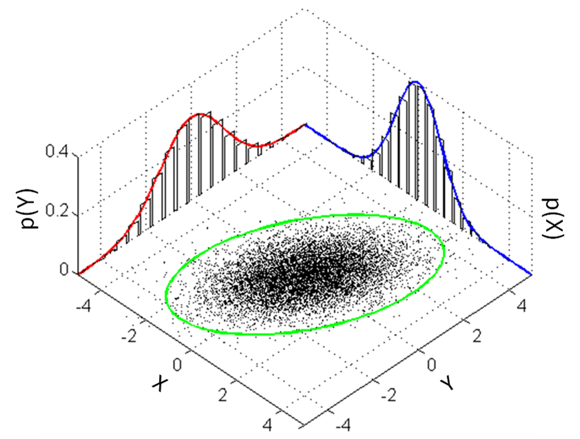
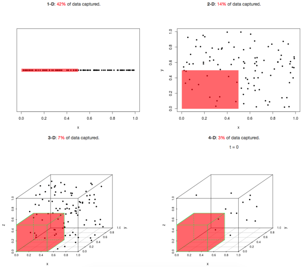
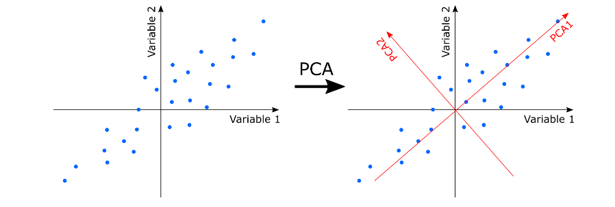
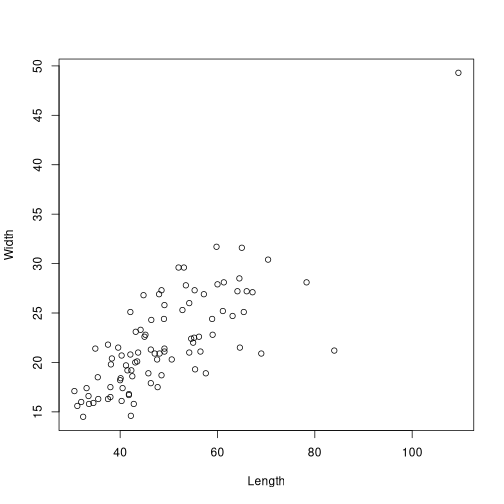
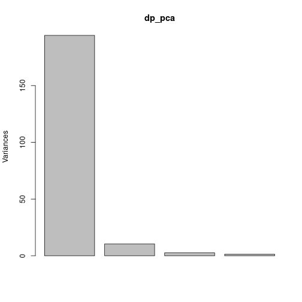
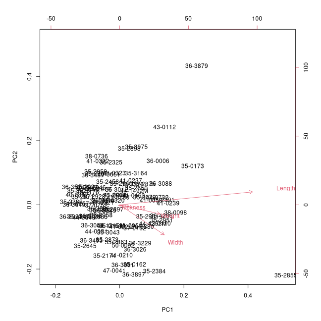

stat4arch
========================================================
author: Petr Pajdla & Peter Tkáč
autosize: true
width: 1920
height: 1080

AES_707: *Statistics seminar for archaeologists*

<!-- <https://support.rstudio.com/hc/en-us/articles/200486468> -->

<!-- =============================================== -->

Seminar 6
========================================================
type: section

`28. 4. 2022`

Today:
<ul style='color:white;'>
<li>Multivariate statistics
<li>Dimensionality reduction
<li>Clustering
</ul>


<!-- =============================================== -->

But first...an exercise!
==========================================================
type: section
Imagine you have radiocarbon data from the whole Czech republic and you want to know from which regions are most of the neolithic data comming. In other words, which districts have most neolithic dates.


Instructions I.
========================================================

1. Download dataset `Lasoles_14C_database.csv` from ZENODO depositary (https://doi.org/10.5281/zenodo.5728242) 
2. Open the dataset in Rstudio (`read.csv`)
3. Observe the dataset. Find out how many observations and variables the dataset has
4. Try to identify the variable which represents uncalibrated radiocarbon dates

## Hints:
- you can find describtion of the dataset and variables in the article bellow:

> "Tkáč, P. and Kolář, J., 2021. Towards New Demography Proxies and Regional Chronologies: Radiocarbon Dates from Archaeological Contexts Located in the Czech Republic Covering the Period Between 10,000 BC and AD 1250. Journal of Open Archaeology Data, 9, p.9. DOI: http://doi.org/10.5334/joad.85

- usefull functions: `here::here()`, `ncol`, `nrow`, `head()`, `str()`

Instructions II.
=============================================================
3. With the help of the `dplyr` package, filter data from the Neolithic period and then count number of observation per district. Put the districts in order, from highest to lowest number of the observations. 

## Hints:
- with the use of `str()` check the __numeric variables__ in your dataframe. If they are a __factor__, you have to change it to numeric by:

`
dataframe$variable <- as.numeric(as.character(dataframe$variable))
`

- in this exercise, __Neolithic__ is defined as a period between __6500__ and __5500__ of uncalibred radiocarbon dates
- useful functions: `here::here()`, `names()`, `str()`, `head()`, `filter()`, `summarise()`, ` %>%`, `arrange()`, `group_by()`

## Additional task:
- select three districts with the most of the dates and compare how their numbers differ in activity areas (variable: `Activity_CZ`). In other words, is there any difference between number of dates coming from graveyards (`poh`) and from settlements (`sid`)? 


Multivariate data & methods
========================================================
type: section

<!-- ----------------------------------------------- -->

Multivariate data
========================================================

### Division based on number of studied variables

- Univariate  
(one variable per observation);
- Bivariate  
(two variables);
- **Multivariate**  
(also *multidimensional*, multiple variables).

***



<!-- ----------------------------------------------- -->

Dimensionality reduction
========================================================
type: sub-section

<!-- ----------------------------------------------- -->

The curse of higher dimensions
========================================================
title: false
left: 60%
incremental: true



***

The *curse* of higher dimensions...

- Computational ineffectivity;
- Low data density in higher dimensions;
- Problematic visualization, we do not easily cope with more than 3D;
- Difficult interpretation *and much more*.


<!-- ----------------------------------------------- -->

Principal components analysis
========================================================

**Goal:** Find low-dimensional representation of the observations that explain a good fraction of the variation.

- First principal component is a direction that maximizes the 
variance of the projected data.
- Second PC is orthogonal to the previous one.



<!-- ----------------------------------------------- -->

PCA I: Data
========================================================
left: 60%
incremental: true

### Data preparation
- Works with numeric data only.
- Format the input as a **matrix**...


```r
data("DartPoints", package = "archdata")
```

```r
dp <- DartPoints %>% 
  select(Length, Width) %>% # select columns
  as.matrix() # format as a matrix
```

```r
# set row names with IDs
rownames(dp) <- DartPoints$Catalog
head(dp, 4)
```

```
        Length Width
41-0322   42.8  15.8
35-2946   40.5  17.4
35-2921   37.5  16.3
36-3487   40.3  16.1
```

***

### Plot the original data

```r
plot(dp)
```



<!-- ----------------------------------------------- -->

PCA II
========================================================
left: 60%
incremental: true

### Do the PCA


```r
dp_pca <- prcomp(dp)
dp_pca
```

```
Standard deviations (1, .., p=2):
[1] 13.377206  3.138274

Rotation (n x k) = (2 x 2):
             PC1        PC2
Length 0.9492163 -0.3146243
Width  0.3146243  0.9492163
```

```r
summary(dp_pca)
```

```
Importance of components:
                           PC1     PC2
Standard deviation     13.3772 3.13827
Proportion of Variance  0.9478 0.05217
Cumulative Proportion   0.9478 1.00000
```

***


```r
plot(dp_pca)
```



*Scree* plot

- Shows the amount of variation explained by each PC.

<!-- ----------------------------------------------- -->

PCA III: Biplot
========================================================


```r
biplot(dp_pca)
```



***


```
Error in loadNamespace(name) : there is no package called 'ggbiplot'
```
