stat4arch
========================================================
author: Petr Pajdla & Peter Tkáč
autosize: true
width: 1920
height: 1080

AES_707: *Statistics seminar for archaeologists*

<!-- <https://support.rstudio.com/hc/en-us/articles/200486468> -->

<!-- =============================================== -->

Seminar 6
========================================================
type: section

`28. 4. 2022`

Today:
<ul style='color:white;'>
<li>Multivariate statistics
<li>Dimensionality reduction
<li>Clustering
</ul>


<!-- =============================================== -->

Multivariate data & methods
========================================================
type: section

<!-- ----------------------------------------------- -->

Multivariate data
========================================================

### Division based on number of studied variables

- Univariate  
(one variable per observation);
- Bivariate  
(two variables);
- **Multivariate**  
(also *multidimensional*, multiple variables).

***


<!-- ----------------------------------------------- -->

Dimensionality reduction
========================================================
type: sub-section

<!-- ----------------------------------------------- -->

The curse of higher dimensions
========================================================
title: false
left: 60%
incremental: true


***

The *curse* of higher dimensions...

- Computational ineffectivity;
- Low data density in higher dimensions;
- Problematic visualization, we do not easily cope with more than 3D;
- Difficult interpretation *and much more*.


<!-- ----------------------------------------------- -->

Principal components analysis
========================================================

**Goal:** Find low-dimensional representation of the observations that explain a good fraction of the variation.

- First principal component is a direction that maximizes the 
variance of the projected data.
- Second PC is orthogonal to the previous one.


<!-- ----------------------------------------------- -->

PCA I: Data
========================================================
left: 60%
incremental: true

### Data preparation
- Works with numeric data only.
- Format the input as a **matrix**...


```r
data("DartPoints", package = "archdata")
```

```r
dp <- DartPoints %>% 
  select(Length, Width) %>% # select columns
  as.matrix() # format as a matrix
```

```r
# set row names with IDs
rownames(dp) <- DartPoints$Catalog
head(dp, 4)
```

```
        Length Width
41-0322   42.8  15.8
35-2946   40.5  17.4
35-2921   37.5  16.3
36-3487   40.3  16.1
```

***

### Plot the original data

```r
plot(dp)
```


<!-- ----------------------------------------------- -->

PCA II
========================================================
left: 60%
incremental: true

### Do the PCA


```r
dp_pca <- prcomp(dp)
dp_pca
```

```
Standard deviations (1, .., p=2):
[1] 13.377206  3.138274

Rotation (n x k) = (2 x 2):
             PC1        PC2
Length 0.9492163 -0.3146243
Width  0.3146243  0.9492163
```

```r
summary(dp_pca)
```

```
Importance of components:
                           PC1     PC2
Standard deviation     13.3772 3.13827
Proportion of Variance  0.9478 0.05217
Cumulative Proportion   0.9478 1.00000
```

***


```r
plot(dp_pca)
```


*Scree* plot

- Shows the amount of variation explained by each PC.

<!-- ----------------------------------------------- -->

PCA III: Biplot
========================================================


```r
biplot(dp_pca)
```


***


```r
ggbiplot::ggbiplot(dp_pca)
```

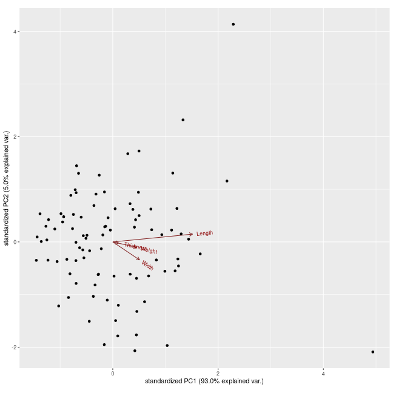

<!-- ----------------------------------------------- -->

PCA IV: The details
========================================================
incremental: true


```r
# structure of the prcomp object
str(dp_pca)
```

```
List of 5
 $ sdev    : num [1:2] 13.38 3.14
 $ rotation: num [1:2, 1:2] 0.949 0.315 -0.315 0.949
  ..- attr(*, "dimnames")=List of 2
  .. ..$ : chr [1:2] "Length" "Width"
  .. ..$ : chr [1:2] "PC1" "PC2"
 $ center  : Named num [1:2] 49.3 22.1
  ..- attr(*, "names")= chr [1:2] "Length" "Width"
 $ scale   : logi FALSE
 $ x       : num [1:91, 1:2] -8.17 -9.85 -13.05 -10.45 -19.35 ...
  ..- attr(*, "dimnames")=List of 2
  .. ..$ : chr [1:91] "41-0322" "35-2946" "35-2921" "36-3487" ...
  .. ..$ : chr [1:2] "PC1" "PC2"
 - attr(*, "class")= chr "prcomp"
```

***


```r
# extract the coordinates
dp_pca_x <- dp_pca$x
head(dp_pca_x)
```

```
               PC1       PC2
41-0322  -8.173985 -3.903419
35-2946  -9.853784 -1.661037
35-2921 -13.047519 -1.761302
36-3487 -10.452638 -2.832093
36-3321 -19.345412  1.168979
35-2959  -8.808577 -2.639578
```

```r
class(dp_pca_x)
```

```
[1] "matrix" "array" 
```

```r
dp_pca_x <- as.data.frame(dp_pca_x)
class(dp_pca_x)
```

```
[1] "data.frame"
```

<!-- ----------------------------------------------- -->

PCA V: Custom plot
========================================================
left: 65%


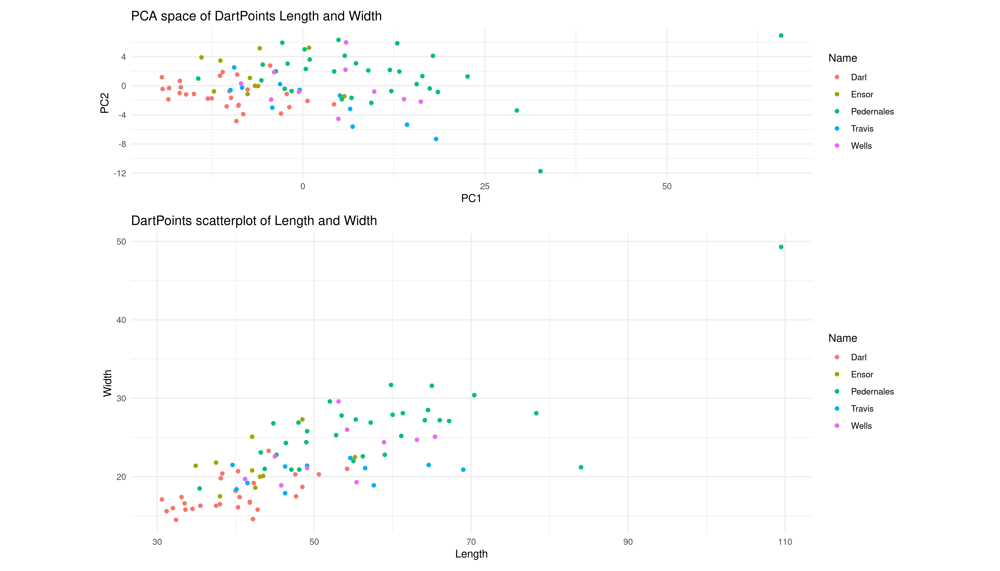

***


```r
dp_pca_x %>% 
  bind_cols(
    type = DartPoints$Name
  ) %>% 
  ggplot(
    aes(PC1, PC2, 
        color = type)
  ) +
  geom_point()
```

<!-- =============================================== -->

Clustering
========================================================
type: sub-section

***

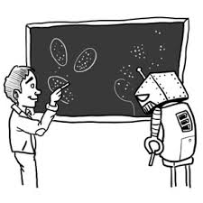

<!-- ----------------------------------------------- -->

Clustering
========================================================
left: 76%
incremental: true

- Broad set of techniques for finding **subgroups**.
- Observations **within groups are quite similar to each other** and observations **in different groups quite different from each other**.

### Clustering methods

- Partitioning: **k-means clustering**
- Agglomerative/divisive: **herarchical clustering**
- Model-based: mixture models

***

  
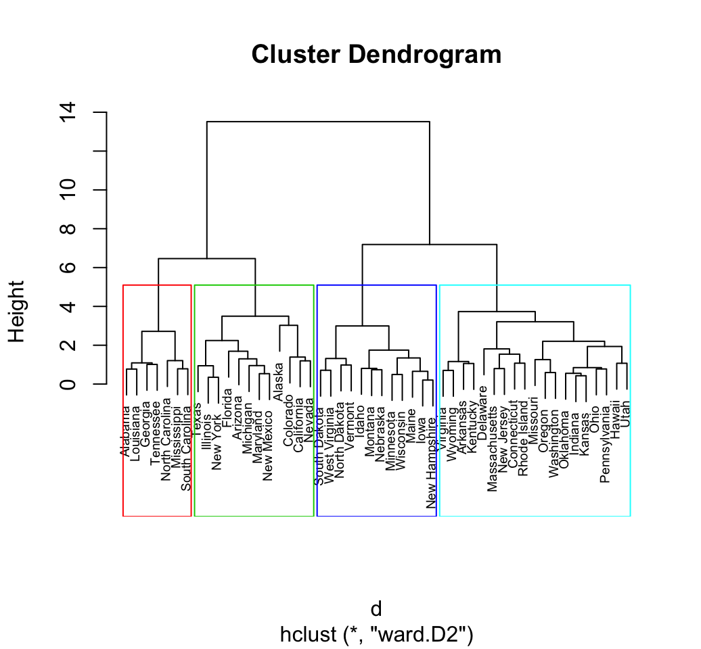

<!-- ----------------------------------------------- -->

K-means partitioning
========================================================
type: sub-section

***

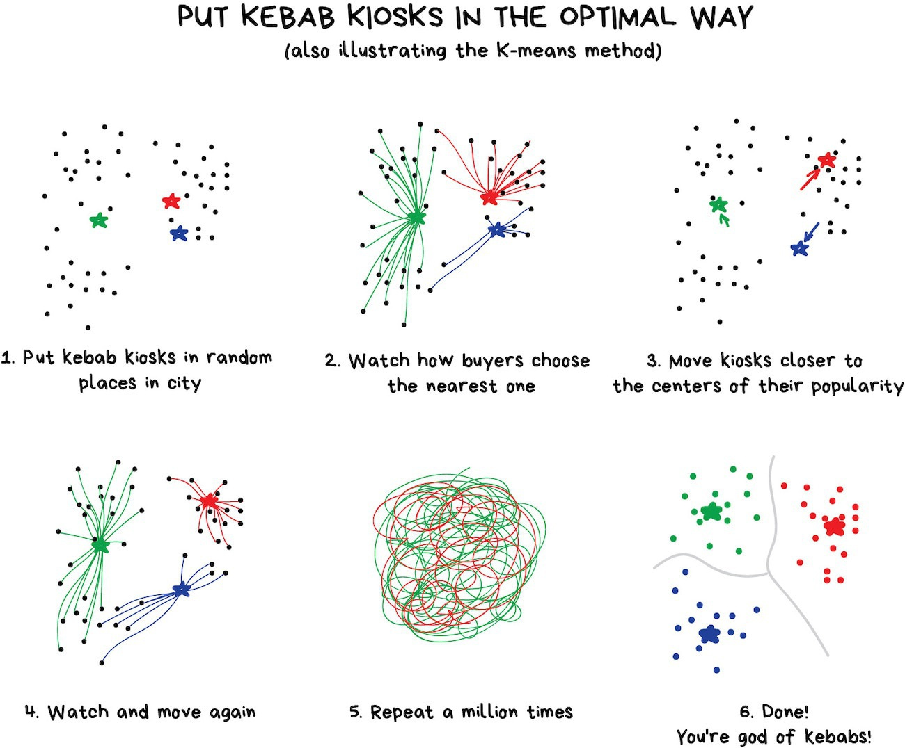

<!-- ----------------------------------------------- -->

K-means partitioning
========================================================

- Simple approach to partitioning a data set into **K** distinct,
non-overlapping clusters.
- **K** is specified beforehand.

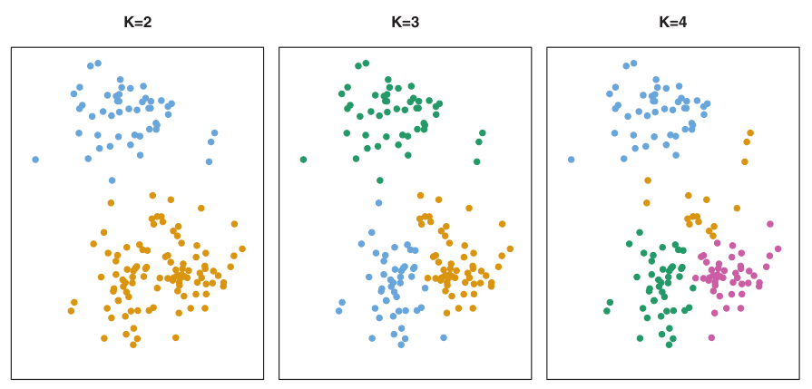  
<p style="font-size:60%;">(James et al. 2013)</p>

<!-- ----------------------------------------------- -->

K-means algorithm
========================================================
left: 42%
title: false
incremental: true

## K-means algorithm

- *K* ... number of clusters.  

### The process: 

1. **Randomly** assign each observation to groups 1 to *K*;
2. For each of *K* clusters, derive its **centroid** (midpoint);
3. **Reassign** each observation into a cluster whose centroid is 
the **closest**;
4. Iterate until stability in cluster assignments is reached (*local vs global optima*).

***

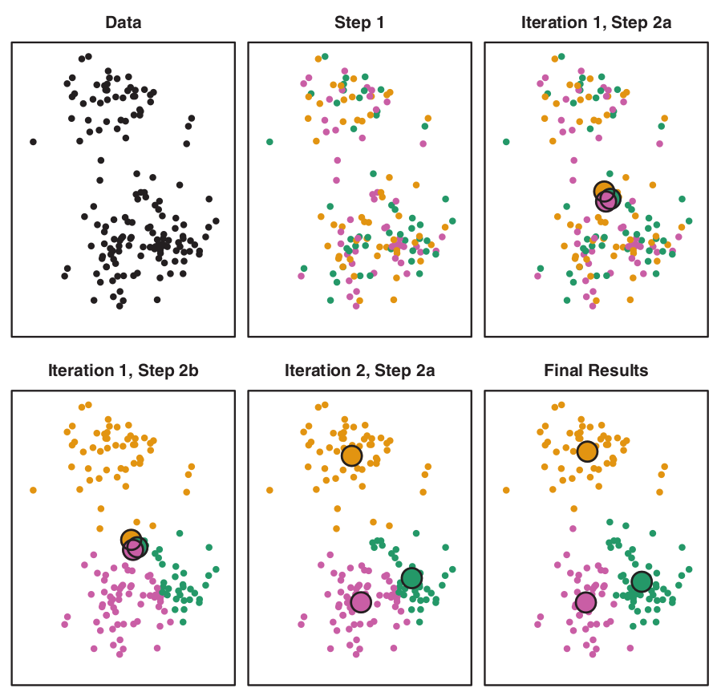  
<p style="font-size:60%;">(James et al. 2013)</p>

<!-- ----------------------------------------------- -->

Some properties of k-means
========================================================

- Standard algorithm for k-means clustering is using 
  **Euclidean distance**.
- Different **local optima** (stability) can be reached.


***

- **Number of clusters** *K* must be specified beforehand.
    - Elbow method;
    - Silhouette method etc.
    
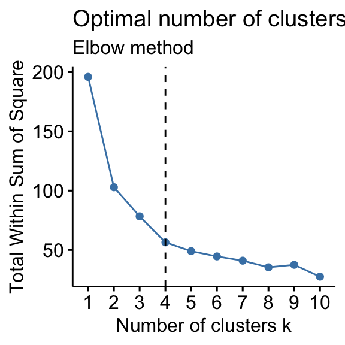

<!-- ----------------------------------------------- -->

K-means I: Data
========================================================
incremental: true


```r
data(Fibulae, package = "archdata")
```

```r
# create matrix
fib <- Fibulae %>% 
  select(
    tot.len = Length, 
    bow.hei = BH,
    foot.len = FL
  ) %>% 
  as.matrix()
head(fib)
```

```
     tot.len bow.hei foot.len
[1,]     114      24       93
[2,]      35       7       21
[3,]      60      15       33
[4,]      74      26       23
[5,]      68      23       20
[6,]      55      15       27
```
***

```r
plot(fib)
```

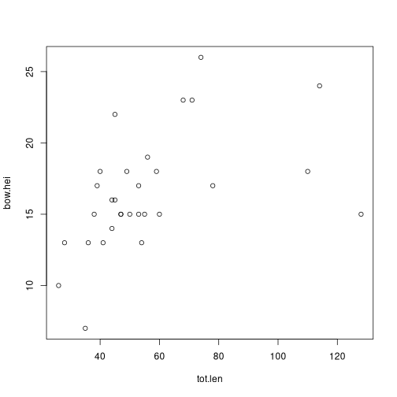

<!-- ----------------------------------------------- -->

K-means II: Reduce dimensions (PCA)
========================================================
incremental: true
left: 60%


```r
# scale + PCA
fib_pca <- prcomp(scale(fib))
```

```r
# summary of a PCA
summary(fib_pca)
```

```
Importance of components:
                          PC1    PC2     PC3
Standard deviation     1.4691 0.8941 0.20585
Proportion of Variance 0.7194 0.2665 0.01412
Cumulative Proportion  0.7194 0.9859 1.00000
```

***


```r
plot(fib_pca$x)
```

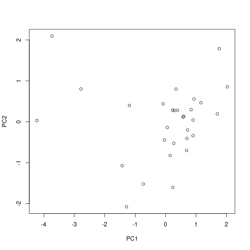

<!-- ----------------------------------------------- -->

K-means III: Find optimal K
========================================================

- Package `factoextra`.


```r
factoextra::fviz_nbclust(fib_pca$x, kmeans)
```

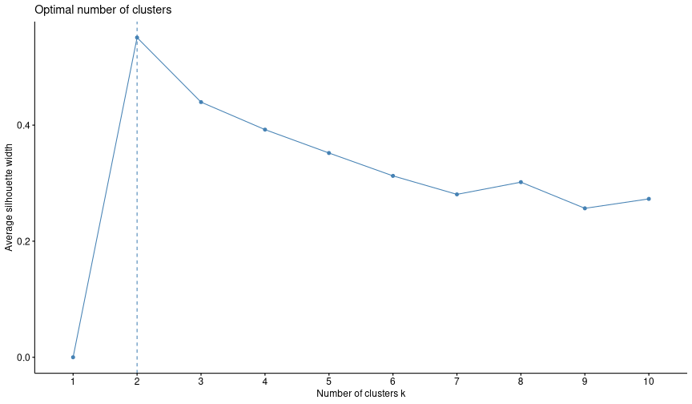

K-means IV
========================================================
incremental: true


```r
fib_km <- kmeans(fib_pca$x, centers = 2)
fib_km
```

```
K-means clustering with 2 clusters of sizes 24, 6

Cluster means:
         PC1          PC2           PC3
1  0.6099434 -0.007314937 -0.0001198279
2 -2.4397737  0.029259748  0.0004793116

Clustering vector:
 [1] 2 1 1 2 1 1 1 1 1 1 2 2 1 1 1 1 1 1 1 1 2 1 1 1 1 1 1 1 1 2

Within cluster sum of squares by cluster:
[1] 22.13457 20.21529
 (between_SS / total_SS =  51.3 %)

Available components:

[1] "cluster"      "centers"      "totss"        "withinss"     "tot.withinss"
[6] "betweenss"    "size"         "iter"         "ifault"      
```

<!-- ----------------------------------------------- -->

K-means V
========================================================
incremental: true
left: 60%


```r
# cluster assignment
fib_km$cluster
```

```
 [1] 2 1 1 2 1 1 1 1 1 1 2 2 1 1 1 1 1 1 1 1 2 1 1 1 1 1 1 1 1 2
```


```r
# create a data frame with clusters
fib_df <- fib_pca$x %>% 
  as.data.frame() %>% 
  bind_cols(
    clust = fib_km$cluster)

head(fib_df, 4)
```

```
          PC1         PC2         PC3 clust
1 -4.22727376  0.03044856  0.60841190     2
2  1.76360759  1.78652460 -0.05839999     1
3 -0.08164798  0.43974905 -0.05057241     1
4 -1.28463323 -2.07589875 -0.24087960     2
```

***


```r
fib_df %>% 
  ggplot(
    aes(PC1, PC2, 
        color = factor(clust))) +
  geom_point(size = 4) +
  theme_minimal()
```

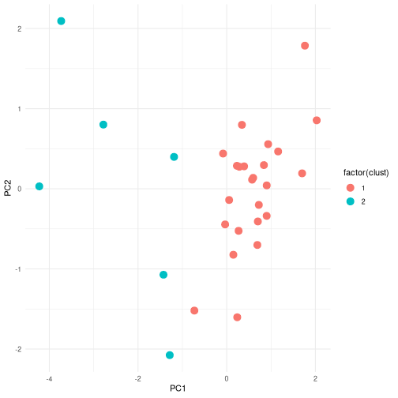

<!-- ----------------------------------------------- -->

K-means VI
========================================================
title: false


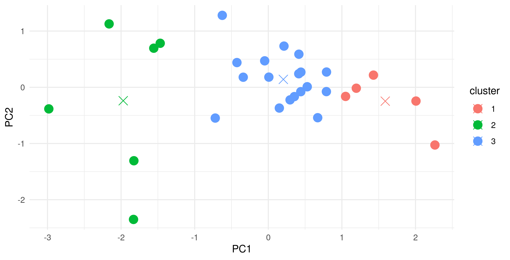

<!-- ----------------------------------------------- -->

Hierarchical clustering
========================================================
type: sub-section

<!-- ----------------------------------------------- -->

Hierarchical clustering
========================================================
incremental: true

- The number of clusters is not specified beforehand.
- Output is a **dendrogram** - a hierarchical structure 
  visualizing the cluster growth.
  
- Starts with a distance matrix.

### Agglomerative algorithm:
1. Put each object in its own cluster;
2. Join the clusters that are the closest;
3. Iterate until a single cluster encompassing all objects is reached.

***

#### Agglomerative:
- Builds the hierarchy of clusters from **bottom-up** until
  a single cluster is reached.

#### Divisive:
- Divides a single large cluster into individual objects (**top-down**).
  
  
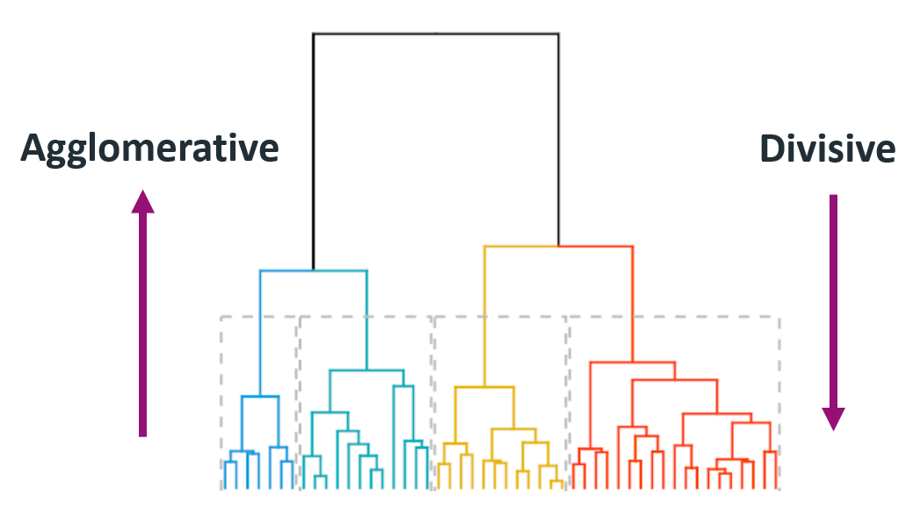

<!-- ----------------------------------------------- -->

Hierarchical clustering algorithms
========================================================
title: false

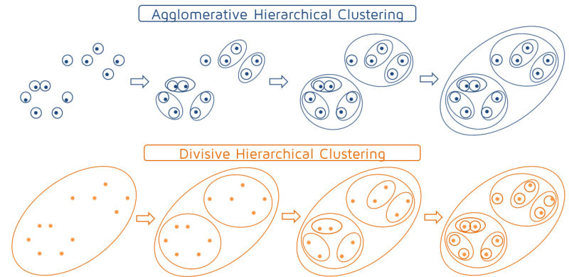

<!-- ----------------------------------------------- -->

Hierarchical clustering I: Data
========================================================
left: 40%
incremental: true


```r
# data set same as in k-means
head(fib)
```

```
     tot.len bow.hei foot.len
[1,]     114      24       93
[2,]      35       7       21
[3,]      60      15       33
[4,]      74      26       23
[5,]      68      23       20
[6,]      55      15       27
```

```r
# create distance matrix
fib_dist <- dist(fib) 
class(fib_dist)
```

```
[1] "dist"
```

***


```r
as.matrix(fib_dist)[1:6, 1:4]
```

```
          1         2        3         4
1   0.00000 108.23123 81.22192 80.647381
2 108.23123   0.00000 28.86174 43.428102
3  81.22192  28.86174  0.00000 20.420578
4  80.64738  43.42810 20.42058  0.000000
5  86.29021  36.68787 17.23369  7.348469
6  88.98314  22.36068  7.81025 22.315914
```

- Matrix with *n* rows and *n* columns.
- Pair-wise distances between the objects.
- Notice the 0 on diagonal, ie. distance to itself is 0.

<!-- ----------------------------------------------- -->

Hierarchical clustering II: Dendrogram
========================================================


```r
fib_hclust <- hclust(fib_dist)
fib_hclust
```

```

Call:
hclust(d = fib_dist)

Cluster method   : complete 
Distance         : euclidean 
Number of objects: 30 
```

***


```r
plot(fib_hclust)
```


<!-- ----------------------------------------------- -->

Hierarchical clustering III: Clusters
========================================================
incremental: true

- Different options where to *cut* the dendrogram...

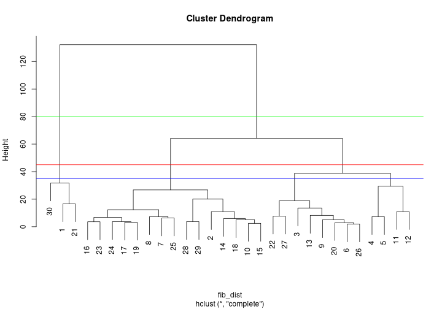

***

- `cutree(x, k, h)` function:
  - specify **k** - number of cluster;
  - specify **h** - height where to cut.


```r
h35 <- cutree(fib_hclust, h = 35)
h35
```

```
 [1] 1 2 3 4 4 3 2 2 3 2 4 4 3 2 2 2 2 2 2 3 1 3 2 2 2 3 3 2 2 1
```


```r
k3 <- cutree(fib_hclust, k = 3)
k3
```

```
 [1] 1 2 3 3 3 3 2 2 3 2 3 3 3 2 2 2 2 2 2 3 1 3 2 2 2 3 3 2 2 1
```

<!-- ----------------------------------------------- -->

Hierarchical clustering IV
========================================================


```r
plot(fib, col = h35)
```

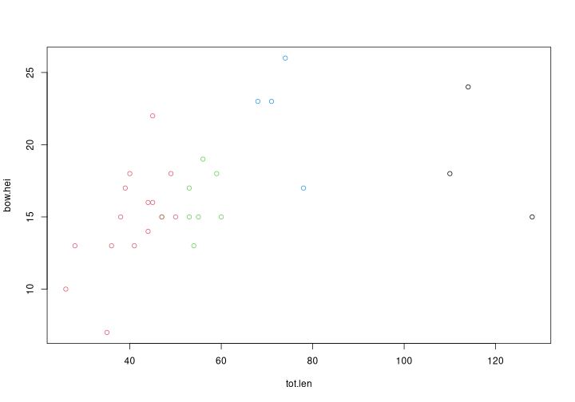

***


```r
plot(fib, col = k3)
```

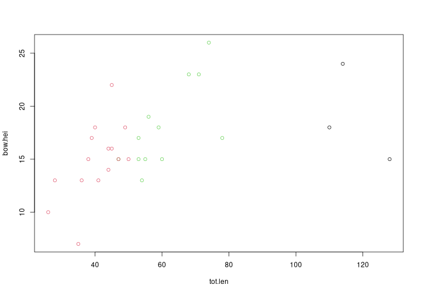

<!-- ----------------------------------------------- -->

Cluster linkage methods I
========================================================


### Complete (maximum) linkage
- Largest distance between clusters.
- `method = "complete"`

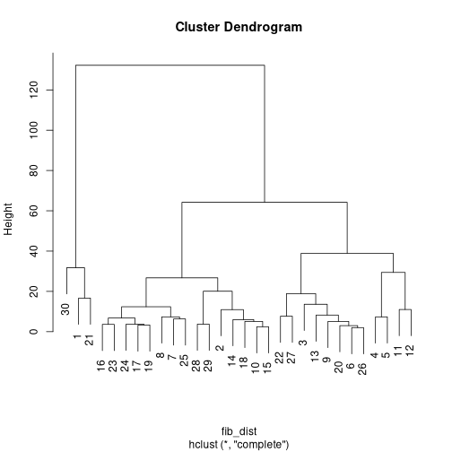

***

### Single (minimum) linkage
- Smallest distance between clusters.
- `method = "single"`

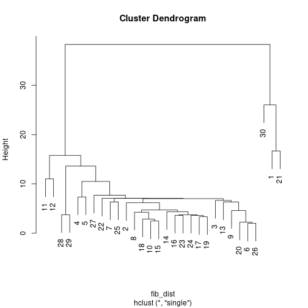

<!-- ----------------------------------------------- -->

Cluster linkage methods II
========================================================

### Mean (average) linkage
- Mean distance between clusters.
- `method = "average"`

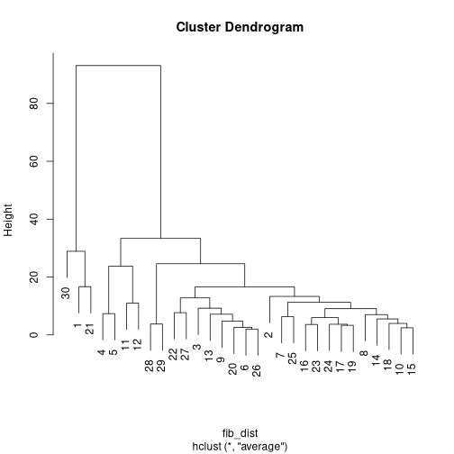

***

### Wards method
- Minimizes total within cluster variance.
- `method = "ward.D2"`

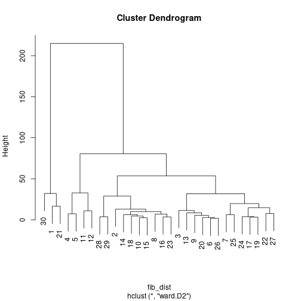

<!-- ----------------------------------------------- -->

Differences
========================================================
title: false
type: prompt

## K-means partitioning

- Pre-specified number of clusters.
- Clusters may vary (different *local optima*).
- Best when groups in data are *hyper*-spheres.

  

***

## Hierarchical clustering

- Variable cluster numbers.
- Clusters are stable.
- Any shape of data distribution.


<!-- ----------------------------------------------- -->

Comparison of k-means vs hclust for k = 2
========================================================
type: prompt


### K-means clustering
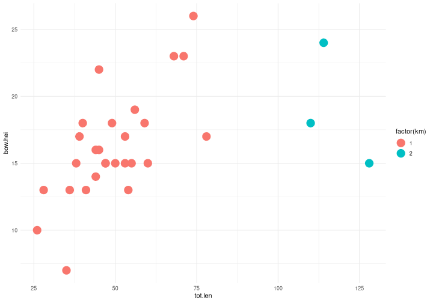

***

### Hierarchical clustering
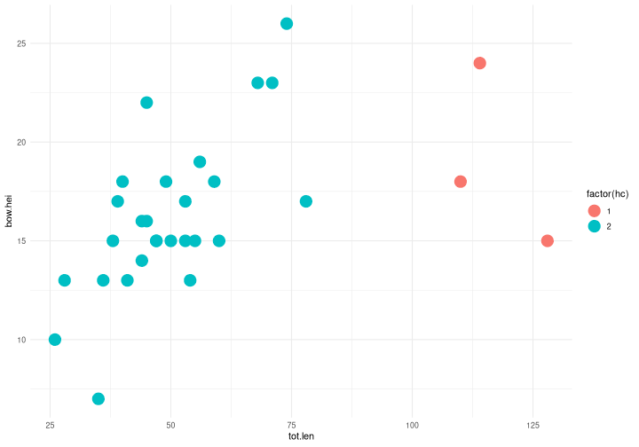

<!-- ----------------------------------------------- -->

Comparison of k-means vs hclust for k = 3
========================================================
type: prompt

### K-means clustering
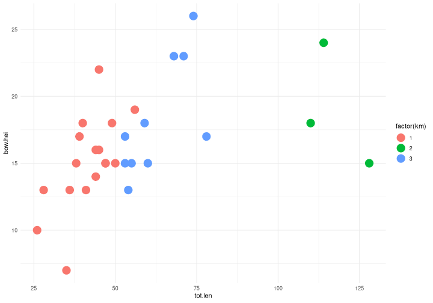

***

### Hierarchical clustering


<!-- ----------------------------------------------- -->

Comparison of k-means vs hclust for k = 4
========================================================
type: prompt

### K-means clustering
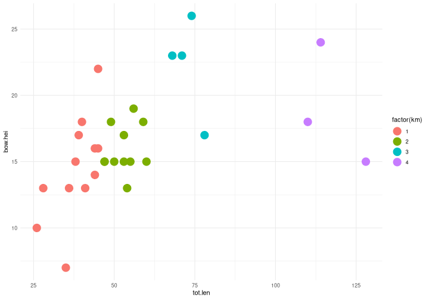

***

### Hierarchical clustering
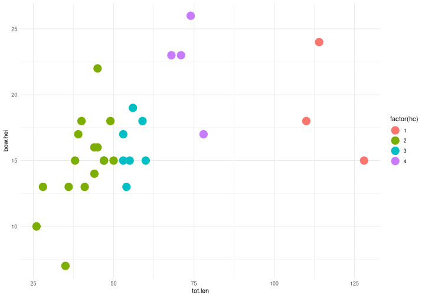

<!-- ----------------------------------------------- -->

